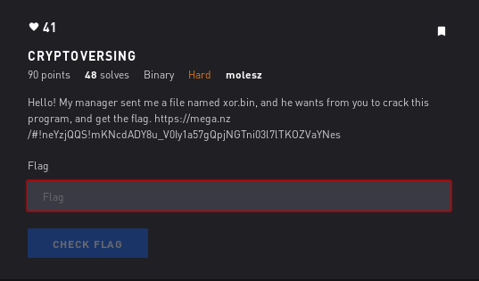
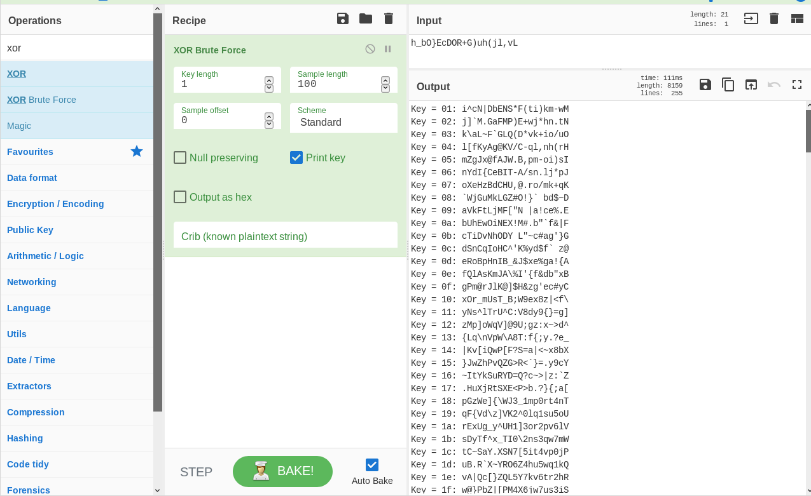

# Cryptoversing - Binary



## Initial Thoughts

* deals with xor

# Walkthrough

After spending countless hours attempting to overflow and decompile using Ghidra I started fresh.

__ltrace ./xor.bin__

```bash
~/ctfwriteups/ctflearn/binary/cryptoversing# ltrace ./xor.bin
printf("[*] Hello! Welcome to our Progra"...[*] Hello! Welcome to our Program!
)    = 68
__isoc99_scanf(0x55ef2f6d7add, 0x7ffe43982cb0, 0x7f1a81ac68c0, 0Enter the password to contiune:  test
) = 1
strlen("test")                                   = 4
strlen("test")                                   = 4
strlen("test")                                   = 4
strlen("h_bO}EcDOR+G)uh(jl,vL")                  = 21
puts("[-] Wrong Password"[-] Wrong Password
)                       = 19
exit(0 <no return ...>
+++ exited (status 0) +++
```

__strlen("h_bO}EcDOR+G)uh(jl,vL")                  = 21__ looks interesting. Lets put that in cyberchef and xor it. Initially I didnt have any ideas what the key would be so I chose the brute force option.



Key 10 and 18 show the first and last part of some password. Combining those forms our flag

<details>
	<summary>Flag</summary>

xOr_mUsT_B3_1mp0rt4nT
</details>
