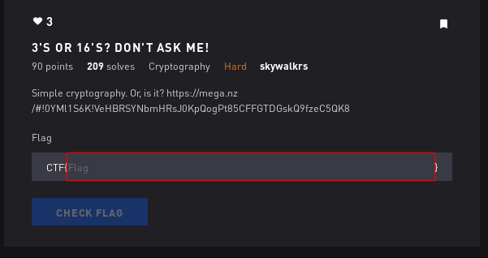

# 3's or 16's



## Initial Thoughts

* decode using cyberchef

# Walkthrough

Threw the mess in cyberchef and poked around a bit. Tried hex and was given the message

```
So, you've discovered my secret. Keep decrypting using this method!
466f7572204d6f72652e203534363837323635363532303464366637323635326532303335333433373337333636363332333033343634333636363337333233363335333236353332333033333334333633363333333633363335333333363333333533333332333333303333333433363334333333363336333633333337333333323333333633333335333333323336333533333332333333303333333333333334333333333333333333333333333333353333333333333334333333333333333433333333333333363333333333333337333333363333333233333333333333353333333333333335333333333333333533333336333333363333333333333334333333333333333933333333333333373333333333333333333333333333333533333336333333363333333333333334333333333333333833333333333333363333333333333335333333333333333733333333333333383333333333333335333333363333333633333333333333343333333633333334333333333333333633333333333333313333333333333337333333333333333333333333333333373333333333333334333333333333333633333333333333353333333333333337333333333333333233333333333333373333333633333334
```

Continued as instructed and popped the flag

<details>
	<summary>Flag</summary>

CTF{U_Is_Hex_Master}
</details>