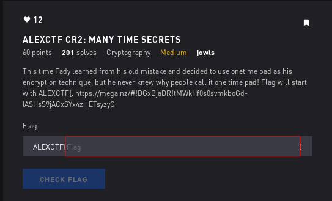

# AlexCTF Many Time Secrets

## Initial Thoughts

* hints at padding suggest weak xoring

# Walkthrough

Start the xor key with the give alexctf{ in cyberchef hex+xor(utf) . This produces "dear fri" on the first string. We can confirm this by now using dear fri as the key and we get alexctf{ as the output. "Guessing" that the rest of the word is friend we can slowly extract the key. Repeat this process using all the given strings as necessary in order to slowly extract the key

	
Flag

ALEXCTF{HERE_GOES_THE_KEY}

