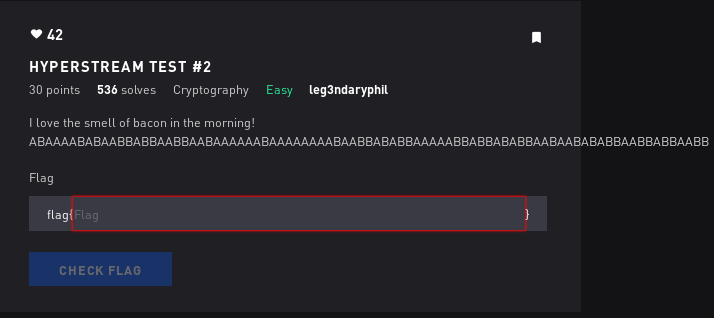

# Hyperstream Test 2 - Crypto

## Initial Thoughts

* looks like the A B might represent 0 1, diving in

# Walkthrough

Messed around with a python script to convert to binary, got nowhere. Googled bacon cipher and voila, found a decoder online

	
Flag

ILOUEBACONDONTYOU

