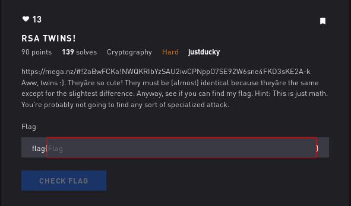

# RSA Twins - Crypto



## Initial Thoughts

* rsa

# Walkthrough

See if we can find factors of n (p and q) using factordb.com
We can! The rest is simple RSA equation. See code below

```python
#!/usr/bin/env python

from Crypto.Util.number import *

#Given n, e and c
n = 14783703403657671882600600446061886156235531325852194800287001788765221084107631153330658325830443132164971084137462046607458019775851952933254941568056899
e = 65537
c = 684151956678815994103733261966890872908254340972007896833477109225858676207046453897176861126186570268646592844185948487733725335274498844684380516667587

#Find p and q by plugging n into factordb.com
p = 121588253559534573498320028934517990374721243335397811413129137253981502291629
q = 121588253559534573498320028934517990374721243335397811413129137253981502291631

#Find the totient(t) with the formula below
t = (p-1)*(q-1)

#Find d using the inverse of e and totient
d = inverse(e, t)

#decrypt message
m = pow(c, d, n)

#print message
print hex(m)[2:-1].decode('hex')
```

<details>
	<summary>Flag</summary>

flag{i_l0v3_tw1N_pr1m3s}
</details>