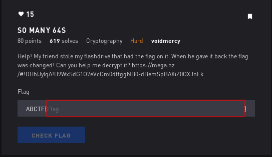

# So Many 64S - Crypto



## Initial Thoughts

* maybe 64 implies base64?

# Walkthrough

Honestly I just threw the giant string into cyberchef and kept piling on base64 until it spit out the flag. I wrote a python script below to do the same thing

```python
#!/usr/bin/env python

flag = open('./flag.txt').read()
b = ""
def decrypt(a):
	b = a.decode('base64')
	if '}' in b:
		print b
		return
	else:
		decrypt(b)
decrypt(flag)
```
<details>
	<summary>Flag</summary>

ABCTF{pr3tty_b4s1c_r1ght?}
</details>