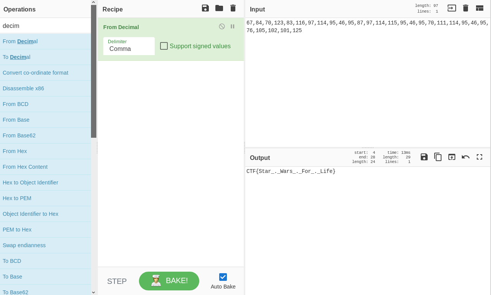

# Symbolic Decimals - Crypto

## Initial Thoughts

* Shift cipher

# Walkthrough

Going to start by putting it into cyberchef.

We were able to spit out a bunch of numbers that looks like it could be decimal ascii to me. Putting the output to the input and dropping the decimal decoder we get the flag

	
Flag

