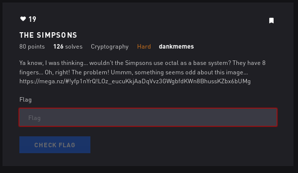
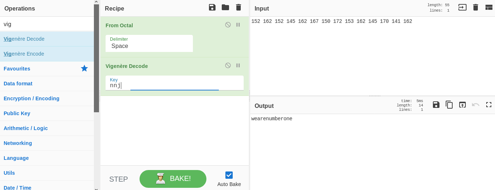

# The Simpsons - Crypto



## Initial Thoughts

* Octal conversion, maybe stego

# Walkthrough

Strings gives us partial code

```
encoded = 152 162 152 145 162 167 150 172 153 162 145 170 141 162
key = chr(SolutionToDis(110 157 167 040 155 165 143 150 040 144 151 144 040 115 141 147 147 151 145 040 157 162 151 147 151 156 141 154 154 171 040 143 157 163 164 077 040 050 104 151 166 151 144 145 144 040 142 171 040 070 054 040 164 157 040 164 150 145 040 156 145 141 162 145 163 164 040 151 156 164 145 147 145 162 054 040 141 156 144 040 164 150 145 156 040 160 154 165 163 040 146 157 165 162 051))
key = key + key + chr(ord(key)-4)
print(DecodeDat(key=key,text=encoded))
```

I have a feeling theres more code to be had so lets keep digging

I didnt find any more code using binwalk or stegsolve but I did put the big decimal piece in cyberchef

```
110 157 167 040 155 165 143 150 040 144 151 144 040 115 141 147 147 151 145 040 157 162 151 147 151 156 141 154 154 171 040 143 157 163 164 077 040 050 104 151 166 151 144 145 144 040 142 171 040 070 054 040 164 157 040 164 150 145 040 156 145 141 162 145 163 164 040 151 156 164 145 147 145 162 054 040 141 156 144 040 164 150 145 156 040 160 154 165 163 040 146 157 165 162 051
```

And used From Octal and it gave me this

```
How much did Maggie originally cost? (Divided by 8, to the nearest integer, and then plus four)
```

Google gives us 847.63 as the answer to that.

848/8 + 4 = __110__

encoded = 152 162 152 145 162 167 150 172 153 162 145 170 141 162
key = chr(110) = __n__
key = key + key + chr(ord(key)-4)
print(DecodeDat(key=key,text=encoded))

so the key is __nnj__

lets see if we can decode the message with that


<details>
	<summary>Flag</summary>


</details>