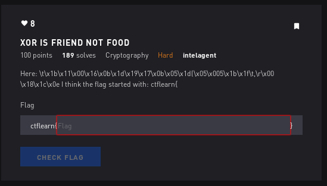
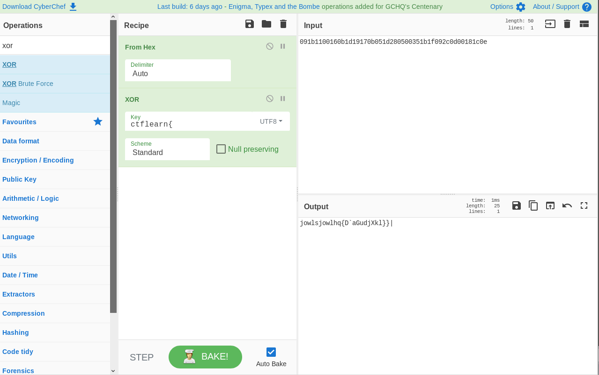

# Xor is Friend Not Food - Crypto

## Initial Thoughts

* xor
* looks like broken up hex

# Walkthrough

__\t\x1b\x11\x00\x16\x0b\x1d\x19\x17\x0b\x05\x1d(\x05\x005\x1b\x1f\t,\r\x00\x18\x1c\x0e__

Lets break this up into proper hex format

__09 1b 11 00 16 0b 1d 19 17 0b 05 1d 28 05 00 35 1b 1f 09 2c 0d 00 18 1c 0e__

Bring our new hex into cyberchef to see if we can get anything good.

Knowing the flag starts with ctflearn{ we can use that as the key

Since we are using the result of what xor'ing with the key should be, this should give us the key and it does. The key is __jowls__ since you can see it start to repeat in the output. Putting that in as our key gives us the complete flag.

	
Flag

ctflearn{xor_is_the_goop}

