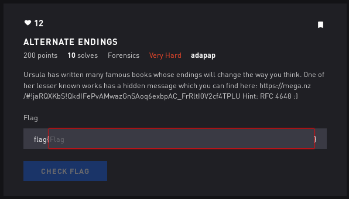

# Alternate Endings - Forensics

## Initial Thoughts

* "endings will change the way you think"
* RFC 4648 - base64 stuff

# Walkthrough

Jim Gallien had driven four miles out of Fairbankswhen he spotted the hitchhiker standing in the snow beside the road,thumb raised high,shivering in the gray Alaska dawn.He didn't appear to be very old:eighteen, maybe nineteen at most.A rifle protruded from the young man's backpack,but he looked friendly enough;a hitchhiker with a Remington semiautomaticisn't the sort of thing that gives motorists pause in the forty-ninth state.Gallien steered his truck onto the shoulder and told the kid to climb in.The hitchhiker swung his pack into the bed of the Ford and introduced himself as Alex."Alex?" Gallien responded,fishing for a last name."Just Alex," the young man replied, pointedly rejecting the bait.Five feet seven or eight with a wiry build,he claimed to be twenty-four years old and said he was from South Dakota.He explained that he wanted a ride as far as the edge of Denali National Park,where he intended to walk deepinto the bush and "live off the land for a few months."Gallien, a union electrician, was on his way to Anchorage,240 miles beyond Denali on the George Parks Highway;he told Alex he'd drop him off wherever he wanted.Alex's backpack looked as though it weighed only twenty-five or thirty pounds,which struck Gallien—an accomplished hunterand woodsman—as an improbably light loadfor a stay of several months in the back-country,especially so early in the spring."He wasn't carrying anywhere near as muchfood and gear as you'd expect a guy Tanana River,Alex gazed across the expanse of windswept muskeg stretching to the south.Gallien wondered whether he'd picked up one of those crackpotsfrom the lower forty-eight who come north to live out ill-considered Jack London fantasies.Alaska has long been a magnet for dreamers and misfits,people who think the unsullied enormity of the Last Frontier will patch all the holes in their lives.The bush is an unforgiving place,however, that cares nothing for hope or longing."People from Outside," reports Gallien in a slow, sonorous drawl,"they'll pick up a copy of Alaska magazine,thumb through it,get to thinkin''Hey, I'm goin' to get on up there,live off the land,go claim me a piece of the good life.'But when they get here and actually head out into the bush—well,it isn't like the magazines make it out to be.The rivers are big and fast.The mosquitoes eat you alive.Most places, there aren't a lot of animals to hunt.Livin' in the bush isn't no picnic."It was a two-hour drive from Fairbanks to the edge of Denali Park.The more they talked, the less Alex struck Gallien as a nutcase.He was congenial and seemed well educated.He peppered Gallien with thoughtful questionsabout the kind of small game that live in the country,the kinds of berries he could eat— "that kind of thing."Still, Gallien was concerned.Alex admitted that the only food in his pack was a ten-pound bag of rice.His gear seemed exceedingly minimal for the harsh conditions of the interior,which in April still lay buried under the winter snowpack.Alex's cheap leather hiking boots were neither waterproof nor well insulated.His rifle was only .22 caliber,a bore too small to rely on if he expected to kill large animals like moose and caribou,which he would have to eat if he hoped to remain very long in the country.He had no ax, no bug dope, no snowshoes, no compass.The only navigational aid in his possessionwas a tattered state road map he'd scrounged at a gas station.A hundred miles out of Fairbanks the highway begins to climb into the foothills of the Alaska Range.As the truck lurched over a bridge across the Nenana River,Alex looked down at the swift current and remarked that he was afraid of the water."A year ago down in Mexico," he told Gallien,"I was out on the ocean in a canoe,and I almost drowned when a storm came up."A little later Alex pulled out his crude mapand pointed to a dashed red linethat intersected the road near the coal-mining town of Healy.It represented a route called the Stampede Trail.Seldom traveled, it isn't even marked on most road maps of Alaska.On Alex's map, nevertheless,the broken line meandered west from the Parks Highwayfor forty miles or so before petering outin the middle of trackless wilderness north of Mt. McKinley.This, Alex announced to Gallien,was where he intended to go.Gallien thought the hitchhiker's schemewas foolhardy and tried repeatedly to dissuade him:"I said the hunting wasn't easy where he was going,that he could go for days without killing any game.When that didn't work, I tried to scare him with bear stories.I told him that a twenty-two probably wouldn't do anything to a grizzly except make him mad.Alex didn't seem too worried.Til climb a tree' is all he said.So I explained that trees don't grow real big in that part of the state,that a bear could knock down one of them skinny little black spruce without even trying.But he wouldn't give an inch.He had an answer for everything I threw at him."Gallien offered to drive Alex all the way to Anchorage,buy him some decent gear, and then drive him back to wherever he wanted to go."No, thanks anyway," Alex replied,"I'll be fine with what I've got."Gallien asked whether he had a hunting license."Hell, no," Alex scoffed."How I feed myself is none of the government's business.Fuck their stupid rules."When Gallien asked whether his parentsor a friend knew what he was up to—whether therewas anyone who would sound the alarmif he got into trouble and was overdue—Alex answered calmly that no,nobody knew of his plans, that in facthe hadn't spoken to his family in nearly two years."I'm absolutely positive," he assured Gallien,"I won't run into anything I can't deal with on my own.""There was just no talking the guy out of it," Gallien remembers."He was determined.Real gung ho.The word that comes to mind is excited.