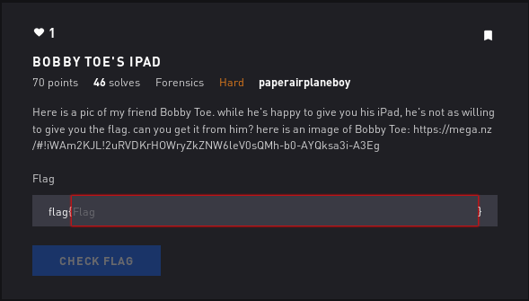

# Bobby Toe's Ipad - Forensics

## Initial Thoughts

* strings shows "congrats you found me! you win an iPad!"
* using bless and saving jfif at the bottom unsuccessful so far

# Walkthrough

Zsteg confirms jpeg exists after the IEND in the png. Removing the congrats string and copying the hex starting from the JFIF header produces a new png

WIP