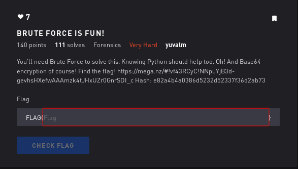

# Brute Force is Fun - Forensics



## Initial Thoughts

* base64
* brute forcing
* hase = __e82a4b4a0386d5232d52337f36d2ab73__

# Walkthrough

We are given the image:


Strings puts out a bunch of folders. Looks like a good opportunity to use binwalk.

The output gives us a zip that is password protected, lets try anyways. It gives us a couple folders and a hint

```
Hmmm... almost!
The password is: "ctflag*****" where * is a number.
Encrypt the password using MD5 and compare it to the given hash!
As I said, you're gonna have to brute force the password!
Good luck! :)
```

We write a simple python script using brute library and hash lib to iterate numbers and md5 sum compare that to the hash above

```python
#!/usr/bin/env python
from brute import brute
import hashlib

hashed = 'e82a4b4a0386d5232d52337f36d2ab73'

for s in brute(length=5, letters=False, numbers=True, symbols=False):
	flag = 'ctflag'+s
	if hashlib.md5(flag).hexdigest() == hashed:
		print flag
		break
```
The output is:

```
ctflag48625
```

This doesnt work as flag input but I remembered the zip was password protected. Unzip that and we are presented with a flag.txt with the contents

```
RkxBR3ttYXlfdGhlX2JydXRlX2ZvcmNlX2JlX3dpdGhfeW91fQ==
```

Looks like a base64 string...confirmed

<details>
	<summary>Flag</summary>

flag{may_the_brute_force_be_with_you}
</details>
