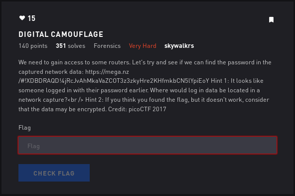

# Digital Camouflage - Forensics

## Initial Thoughts

* probably a pcap
* where is router login data stored?

# Walkthrough

Filter http with wireshark. Notice theres one POST stream. Follow the stream to locate the usr/pass

__userid=hardawayn&pswrd=UEFwZHNqUlRhZQ%3D%3D__

%3D in html is the "=" sign so lets clean up the pass

__UEFwZHNqUlRhZQ==__ looks like base64 to me

	
Flag

PApdsjRTae

