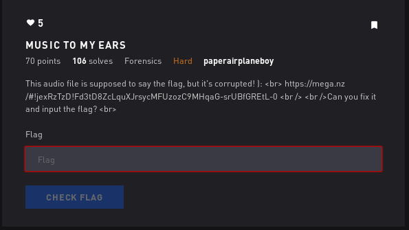

# Music to My Ears - Forensics

## Initial Thoughts

* Might involve fixing a header

# Walkthrough

I messed around with bless for a while with no luck. Ended watching this video https://www.youtube.com/watch?v=Zy4LDk_Tszo and followed the instructions. At the part where the m4a file is decoded to a wav i tried playing it and was able to secure the flag.

	
Flag

1_c4n_f1x_it

