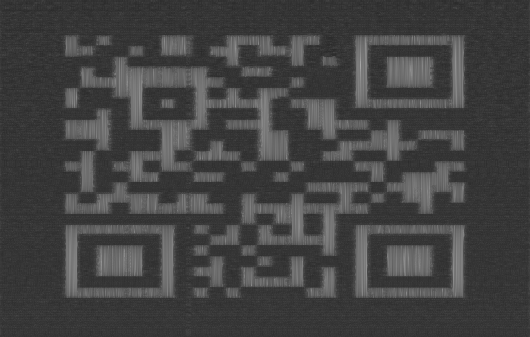

# Seeing is Believing - Forensics

## Initial Thoughts

* zip file containing audio file

# Walkthrough

Open the audio file with audacity and check the spectrogram. Looks like a qr code. Mess with the spectrogram settings to make it look nice and I actually ended up scanning it with my phone

	
Flag

the_flag_is{A_sP3c7r0grAm?!}

