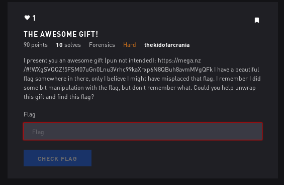

# The Awesome Gift - Forensics



## Initial Thoughts

* Hints/comments say the end is dumb

# Walkthrough


Lets dive in with the low hanging fruit grabs, strings, stegsolve, zsteg etc

Strings shows data after IEND

<details>
	<summary>Hexdump xor brute</summary>

```
Key = 01: c&sh '7###+#]y92X]yg8i]ybd?OC]yg9"##]yg8"##]&#?#aOFFSvw*# `]y84fzh]y84fzV[(#"']yb` ##']yb` ##6]ydb]y
Key = 02: `%pk#$4   ( ^z:1[^zd;j^zag<L@^zd:!  ^zd;!  ^% < bLEEPut) #c^z;7eyk^z;7eyUX+ !$^zac#  $^zac#  5^zga^z
Key = 03: a$qj"%5!!!)!_{;0Z_{e:k_{`f=MA_{e; !!_{e: !!_$!=!cMDDQtu(!"b_{:6dxj_{:6dxTY*! %_{`b"!!%_{`b"!!4_{f`_{
Key = 04: f#vm%"2&&&.&X|<7]X|b=lX|ga:JFX|b<'&&X|b='&&X#&:&dJCCVsr/&%eX|=1c.mX|=1c.S^-&'"X|ge%&&"X|ge%&&3X|agX|
Key = 05: g"wl$#3'''/'Y}=6\Y}c<mY}f`;KGY}c=&''Y}c<&''Y"';'eKBBWrs.'$dY}<0b~lY}<0b~R_,'&#Y}fd$''#Y}fd$''2Y}`fY}
Key = 06: d!to' 0$$$,$Z~>5_Z~`?nZ~ec8HDZ~`>%$$Z~`?%$$Z!$8$fHAATqp-$'gZ~?3a}oZ~?3a}Q\/$% Z~eg'$$ Z~eg'$$1Z~ceZ~
Key = : e un&!1%%%-%[.?4^[.a>o[.db9IE[.a?$%%[.a>$%%[ %9%gI@@Upq,%&f[.>2`|n[.>2`|P].%$![.df&%%![.df&%%0[.bd[.
Key = 08: j/za).>***"*Tp0;QTpn1`Tpkm6FJTpn0+**Tpn1+**T/*6*hFOOZ.~#*)iTp1=osaTp1=os_R!*+.Tpki)**.Tpki)**?TpmkTp
Key = 09: k.{`(/?+++#+Uq1:PUqo0aUqjl7GKUqo1*++Uqo0*++U.+7+iGNN[~."+(hUq0<nr`Uq0<nr^S +*/Uqjh(++/Uqjh(++>UqljUq
Key = 0a: h-xc+,<((( (Vr29SVrl3bVrio4DHVrl2)((Vrl3)((V-(4(jDMMX}|!(+kVr3?mqcVr3?mq]P#(),Vrik+((,Vrik+((=VroiVr
Key = 0b: i,yb*-=)))!)Ws38RWsm2cWshn5EIWsm3())Wsm2())W,)5)kELLY|} )*jWs2>lpbWs2>lp\Q")(-Wshj*))-Wshj*))<WsnhWs
Key = 0c: n+~e-*:...&.Pt4?UPtj5dPtoi2BNPtj4/..Ptj5/..P+.2.lBKK^{z'.-mPt59kwePt59kw[V%./*Ptom-..*Ptom-..;PtioPt
Key = 0d: o*.d,+;///'/Qu5>TQuk4eQunh3COQuk5.//Quk4.//Q*/3/mCJJ_z{&/,lQu48jvdQu48jvZW$/.+Qunl,//+Qunl,//:QuhnQu
Key = 0e: l)|g/(8,,,$,Rv6=WRvh7fRvmk0@LRvh6-,,Rvh7-,,R),0,n@II\yx%,/oRv7;iugRv7;iuYT',-(Rvmo/,,(Rvmo/,,9RvkmRv
Key = 0f: m(}f.)9---%-Sw7<VSwi6gSwlj1AMSwi7,--Swi6,--S(-1-oAHH]xy$-.nSw6:htfSw6:htXU&-,)Swln.--)Swln.--8SwjlSw
Key = 10: r7by16&222:2Lh(#ILhv)xLhsu.^RLhv(322Lhv)322L72.2p^WWBgf;21qLh)%wkyLh)%wkGJ9236Lhsq1226Lhsq122'LhusLh
Key = 11: s6cx'333;3Mi)"HMiw(yMirt/_SMiw)233Miw(233M63/3q_VVCfg:30pMi($vjxMi($vjFK8327Mirp0337Mirp033&MitrMi
Key = 12: p5`{34$00080Nj*!KNjt+zNjqw,\PNjt*100Njt+100N50,0r\UU@ed903sNj+'ui{Nj+'uiEH;014Njqs3004Njqs300%NjwqNj
Key = 13: q4az25%11191Ok+ JOku*{Okpv-]QOku+011Oku*011O41-1s]TTAde812rOk*&thzOk*&thDI:105Okpr2115Okpr211$OkvpOk
Key = 14: v3f}52"666>6Hl,'MHlr-|Hlwq*ZVHlr,766Hlr-766H36*6tZSSFcb?65uHl-!so}Hl-!soCN=672Hlwu5662Hlwu566#HlqwHl
Key = 15: w2g|43#777?7Im-&LIms,}Imvp+[WIms-677Ims,677I27+7u[RRGbc>74tIm, rn|Im, rnBO<763Imvt4773Imvt477"ImpvIm
Key = 16: t1d.70 444<4Jn.%OJnp/~Jnus(XTJnp.544Jnp/544J14(4vXQQDa`=47wJn/#qm.Jn/#qmAL?450Jnuw7440Jnuw744!JnsuJn
Key = 17: u0e~61!555=5Ko/$NKoq..Kotr)YUKoq/455Koq.455K05)5wYPPE`a<56vKo."pl~Ko."pl@M>541Kotv6551Kotv655 KortKo
Key = 18: z?jq9>.:::2:D` +AD`~!pD`{}&VZD`~ ;::D`~!;::D?:&:xV__Jon3:9yD`!-.cqD`!-.cOB1:;>D`{y9::>D`{y9::/D`}{D`
Key = 19: {>kp8?/;;;3;Ea!*@Ea. qEaz|'W[Ea.!:;;Ea. :;;E>;';yW^^Kno2;8xEa ,~bpEa ,~bNC0;:?Eazx8;;?Eazx8;;.Ea|zEa
Key = 1a: x=hs;<,88808Fb")CFb|#rFby.$TXFb|"988Fb|#988F=8$8zT]]Hml18;{Fb#/}asFb#/}aM@389<Fby{;88<Fby{;88-Fb.yFb
Key = 1b: y<ir:=-99919Gc#(BGc}"sGcx~%UYGc}#899Gc}"899G<9%9{U\\Ilm09:zGc".|`rGc".|`LA298=Gcxz:99=Gcxz:99,Gc~xGc
Key = 1c: ~;nu=:*>>>6>@d$/E@dz%t@d.y"R^@dz$?>>@dz%?>>@;>">|R[[Nkj7>=}@d%){gu@d%){gKF5>?:@d.}=>>:@d.}=>>+@dy.@d
Key = 1d: .:ot<;+???7?Ae%.DAe{$uAe~x#S_Ae{%>??Ae{$>??A:?#?}SZZOjk6?<|Ae$(zftAe$(zfJG4?>;Ae~|<??;Ae~|<??*Aex~Ae
Key = 1e: |9lw?8(<<<4<Bf&-GBfx'vBf}{ P\Bfx&=<<Bfx'=<<B9< <~PYYLih5<?.Bf'+yewBf'+yeID7<=8Bf}.?<<8Bf}.?<<)Bf{}Bf
Key = 1f: }8mv>9)===5=Cg',FCgy&wCg|z!Q]Cgy'<==Cgy&<==C8=!=.QXXMhi4=>~Cg&*xdvCg&*xdHE6=<9Cg|~>==9Cg|~>==(Cgz|Cg
Key = 20: B.RI........|X..y|XF.H|XCE.nb|XF....|XF....|....@nggrWV...A|X..G[I|X..G[wz....|XCA....|XCA....|XEC|X
Key = 21: C.SH........}Y..x}YG.I}YBD.oc}YG....}YG....}....AoffsVW...@}Y..FZH}Y..FZv{....}YB@....}YB@....}YDB}Y
Key = 22: @.PK........~Z..{~ZD.J~ZAG.l`~ZD....~ZD....~....BleepUT...C~Z..EYK~Z..EYux....~ZAC....~ZAC....~ZGA~Z < INTERESTING
Key = 23: A.QJ.........[..z.[E.K.[@F.ma.[E.....[E.........CmddqTU...B.[..DXJ.[..DXty.....[@B.....[@B.....[F@.[
Key = 24: F.VM........x\..}x\B.Lx\GA.jfx\B....x\B....x....DjccvSR...Ex\..C_Mx\..C_s~....x\GE....x\GE....x\AGx\
Key = 25: G.WL........y]..|y]C.My]F@.kgy]C....y]C....y....EkbbwRS...Dy]..B^Ly]..B^r.....y]FD....y]FD....y]@Fy]
Key = 26: D.TO........z^...z^@.Nz^EC.hdz^@....z^@....z....FhaatQP...Gz^..A]Oz^..A]q|....z^EG....z^EG....z^CEz^
Key = 27: E.UN........{_..~{_A.O{_DB.ie{_A....{_A....{....Gi``uPQ...F{_..@\N{_..@\p}....{_DF....{_DF....{_BD{_
Key = 28: J.ZA........tP..qtPN.@tPKM.fjtPN....tPN....t....Hfooz_^...ItP..OSAtP..OS.r....tPKI....tPKI....tPMKtP
Key = 29: K.[@........uQ..puQO.AuQJL.gkuQO....uQO....u....Ignn{^_...HuQ..NR@uQ..NR~s....uQJH....uQJH....uQLJuQ
Key = 2a: H.XC........vR..svRL.BvRIO.dhvRL....vRL....v....Jdmmx]\...KvR..MQCvR..MQ}p....vRIK....vRIK....vROIvR
Key = 2b: I.YB........wS..rwSM.CwSHN.eiwSM....wSM....w....Kelly\]...JwS..LPBwS..LP|q....wSHJ....wSHJ....wSNHwS
Key = 2c: N.^E........pT..upTJ.DpTOI.bnpTJ....pTJ....p....Lbkk~[Z...MpT..KWEpT..KW{v....pTOM....pTOM....pTIOpT
Key = 2d: O._D........qU..tqUK.EqUNH.coqUK....qUK....q....Mcjj.Z[...LqU..JVDqU..JVzw....qUNL....qUNL....qUHNqU
Key = 2e: L.\G........rV..wrVH.FrVMK.`lrVH....rVH....r....N`ii|YX...OrV..IUGrV..IUyt....rVMO....rVMO....rVKMrV
Key = 2f: M.]F........sW..vsWI.GsWLJ.amsWI....sWI....s....Oahh}XY...NsW..HTFsW..HTxu....sWLN....sWLN....sWJLsW
Key = 30: R.BY........lH..ilHV.XlHSU.~rlHV....lHV....l....P~wwbGF...QlH..WKYlH..WKgj....lHSQ....lHSQ....lHUSlH
Key = 31: S.CX........mI..hmIW.YmIRT..smIW....mIW....m....Q.vvcFG...PmI..VJXmI..VJfk....mIRP....mIRP....mITRmI
Key = 32: P.@[........nJ..knJT.ZnJQW.|pnJT....nJT....n....R|uu`ED...SnJ..UI[nJ..UIeh....nJQS....nJQS....nJWQnJ
Key = 33: Q.AZ........oK..joKU.[oKPV.}qoKU....oKU....o....S}ttaDE...RoK..THZoK..THdi....oKPR....oKPR....oKVPoK
Key = 34: V.F]........hL..mhLR.\hLWQ.zvhLR....hLR....h....TzssfCB...UhL..SO]hL..SOcn....hLWU....hLWU....hLQWhL
Key = 35: W.G\........iM..liMS.]iMVP.{wiMS....iMS....i....U{rrgBC...TiM..RN\iM..RNbo....iMVT....iMVT....iMPViM
Key = 36: T.D_........jN..ojNP.^jNUS.xtjNP....jNP....j....VxqqdA@...WjN..QM_jN..QMal....jNUW....jNUW....jNSUjN
Key = 37: U.E^........kO..nkOQ._kOTR.yukOQ....kOQ....k....Wyppe@A...VkO..PL^kO..PL`m....kOTV....kOTV....kORTkO
Key = 38: Z.JQ........d@..ad@^.Pd@[].vzd@^....d@^....d....Xv..jON...Yd@.._CQd@.._Cob....d@[Y....d@[Y....d@][d@
Key = 39: [.KP........eA..`eA_.QeAZ\.w{eA_....eA_....e....Yw~~kNO...XeA..^BPeA..^Bnc....eAZX....eAZX....eA\ZeA
Key = 3a: X.HS........fB..cfB\.RfBY_.txfB\....fB\....f....Zt}}hML...[fB..]ASfB..]Am`....fBY[....fBY[....fB_YfB
Key = 3b: Y.IR........gC..bgC].SgCX^.uygC]....gC]....g....[u||iLM...ZgC..\@RgC..\@la....gCXZ....gCXZ....gC^XgC
Key = 3c: ^.NU........`D..e`DZ.T`D_Y.r~`DZ....`DZ....`....\r{{nKJ...]`D..[GU`D..[Gkf....`D_]....`D_]....`DY_`D
Key = 3d: _.OT........aE..daE[.UaE^X.s.aE[....aE[....a....]szzoJK...\aE..ZFTaE..ZFjg....aE^\....aE^\....aEX^aE
Key = 3e: \.LW........bF..gbFX.VbF][.p|bFX....bFX....b....^pyylIH..._bF..YEWbF..YEid....bF]_....bF]_....bF[]bF
Key = 3f: ].MV........cG..fcGY.WcG\Z.q}cGY....cGY....c...._qxxmHI...^cG..XDVcG..XDhe....cG\^....cG\^....cGZ\cG
Key = 40: "g2)afvbbbjb.8xs..8&y(.8#%~...8&xcbb.8&ycbb.gb~b ....76kba!.8yu';).8yu';..ibcf.8#!abbf.8#!abbw.8%#.8
Key = 41: #f3(`gwccckc.9yr..9'x).9"$....9'ybcc.9'xbcc.fc.c!....67jc` .9xt&:(.9xt&:..hcbg.9" `ccg.9" `ccv.9$".9
Key = 42:  e0+cdt```h`.:zq..:${*.:!'|...:$za``.:${a``.e`|`"....54i`c#.:{w%9+.:{w%9..k`ad.:!#c``d.:!#c``u.:'!.:
Key = 43: !d1*beuaaaia.;{p..;%z+.; &}...;%{`aa.;%z`aa.da}a#....45hab".;zv$8*.;zv$8..ja`e.; "baae.; "baat.;& .;
Key = 44: &c6-ebrfffnf.<|w..<"},.<'!z...<"|gff.<"}gff.cfzf$....32ofe%.<}q#?-.<}q#?..mfgb.<'%effb.<'%effs.<!'.<
Key = 45: 'b7,dcsgggog.=}v..=#|-.=& {...=#}fgg.=#|fgg.bg{g%....23ngd$.=|p">,.=|p">..lgfc.=&$dggc.=&$dggr.= &.=
Key = 46: $a4/g`pdddld.>~u..> ...>%#x...> ~edd.> .edd.adxd&....10mdg'.>.s!=/.>.s!=..ode`.>%'gdd`.>%'gddq.>#%.>
Key = 47: %`5.faqeeeme.?.t..?!~/.?$"y...?!.dee.?!~dee.`eye'....01lef&.?~r <..?~r <..neda.?$&feea.?$&feep.?"$.?
Key = 48: *o:!in~jjjbj.0p{..0.q .0+-v...0.pkjj.0.qkjj.ojvj(....?>cji).0q}/3!.0q}/3..ajkn.0+)ijjn.0+)ijj..0-+.0
Key = 49: +n; ho.kkkck.1qz..1/p!.1*,w...1/qjkk.1/pjkk.nkwk)....>?bkh(.1p|.2 .1p|.2..`kjo.1*(hkko.1*(hkk~.1,*.1
Key = 4a: (m8#kl|hhh`h.2ry..2,s".2)/t...2,rihh.2,sihh.mhth*....=<ahk+.2s.-1#.2s.-1..chil.2)+khhl.2)+khh}.2/).2
Key = 4b: )l9"jm}iiiai.3sx..3-r#.3(.u...3-shii.3-rhii.liui+....<=`ij*.3r~,0".3r~,0..bihm.3(*jiim.3(*jii|.3.(.3
Key = 4c: .k>%mjznnnfn.4t...4*u$.4/)r...4*tonn.4*uonn.knrn,....;:gnm-.4uy+7%.4uy+7..enoj.4/-mnnj.4/-mnn{.4)/.4
Key = 4d: /j?$lk{ooogo.5u~..5+t%.5.(s...5+unoo.5+tnoo.joso-....:;fol,.5tx*6$.5tx*6..donk.5.,look.5.,looz.5(..5
Key = 4e: ,i<'ohxllldl.6v}..6(w&.6-+p...6(vmll.6(wmll.ilpl.....98elo/.6w{)5'.6w{)5..glmh.6-/ollh.6-/olly.6+-.6
Key = 4f: -h=&niymmmem.7w|..7)v'.7,*q...7)wlmm.7)vlmm.hmqm/....89dmn..7vz(4&.7vz(4..fmli.7,.nmmi.7,.nmmx.7*,.7
Key = 50: 2w"9qvfrrrzr.(hc..(6i8.(35n...(6hsrr.(6isrr.wrnr0....'&{rq1.(ie7+9.(ie7+..yrsv.(31qrrv.(31qrrg.(53.(
Key = 51: 3v#8pwgsss{s.)ib..)7h9.)24o...)7irss.)7hrss.vsos1....&'zsp0.)hd6*8.)hd6*..xsrw.)20pssw.)20pssf.)42.)
Key = 52: 0u ;stdpppxp.*ja..*4k:.*17l...*4jqpp.*4kqpp.uplp2....%$yps3.*kg5);.*kg5)..{pqt.*13sppt.*13sppe.*71.*
Key = 53: 1t!:rueqqqyq.+k`..+5j;.+06m...+5kpqq.+5jpqq.tqmq3....$%xqr2.+jf4(:.+jf4(..zqpu.+02rqqu.+02rqqd.+60.+
Key = 54: 6s&=urbvvv~v.,lg..,2m<.,71j...,2lwvv.,2mwvv.svjv4....#".vu5.,ma3/=.,ma3/..}vwr.,75uvvr.,75uvvc.,17.,
Key = 55: 7r'<tscwww.w.-mf..-3l=.-60k...-3mvww.-3lvww.rwkw5...."#~wt4.-l`2.<.-l`2...|wvs.-64twws.-64twwb.-06.-
Key = 56: 4q$?wp`ttt|t..ne...0o>..53h....0nutt..0outt.qtht6....! }tw7..oc1-?..oc1-...tup..57wttp..57wtta..35..
Key = 57: 5p%>vqauuu}u./od../1n?./42i.../1otuu./1ntuu.puiu7.... !|uv6./nb0,>./nb0,..~utq./46vuuq./46vuu`./24./
Key = 58: :.*1y~nzzzrz. `k.. >a0. ;=f... >`{zz. >a{zz..zfz8..../.szy9. am?#1. am?#..qz{~. ;9yzz~. ;9yzzo. =;. 
Key = 59: ;~+0x.o{{{s{.!aj..!?`1.!:<g...!?az{{.!?`z{{.~{g{9...../r{x8.!`l>"0.!`l>"..p{z..!:8x{{..!:8x{{n.!<:.!
Key = 5a: 8}(3{|lxxxpx."bi.."<c2."9?d..."<byxx."<cyxx.}xdx:....-,qx{;."co=!3."co=!..sxy|."9;{xx|."9;{xxm."?9."
Key = 5b: 9|)2z}myyyqy.#ch..#=b3.#8>e...#=cxyy.#=bxyy.|yey;....,-pyz:.#bn< 2.#bn< ..ryx}.#8:zyy}.#8:zyyl.#>8.#
Key = 5c: >{.5}zj~~~v~.$do..$:e4.$?9b...$:d.~~.$:e.~~.{~b~<....+*w~}=.$ei;'5.$ei;'..u~.z.$?=}~~z.$?=}~~k.$9?.$
Key = 5d: ?z/4|{k...w..%en..%;d5.%>8c...%;e~...%;d~...z.c.=....*+v.|<.%dh:&4.%dh:&..t.~{.%><|..{.%><|..j.%8>.%
Key = 5e: <y,7.xh|||t|.&fm..&8g6.&=;`...&8f}||.&8g}||.y|`|>....)(u|.?.&gk9%7.&gk9%..w|}x.&=?.||x.&=?.||i.&;=.&
Key = 5f: =x-6~yi}}}u}.'gl..'9f7.'<:a...'9g|}}.'9f|}}.x}a}?....()t}~>.'fj8$6.'fj8$..v}|y.'<>~}}y.'<>~}}h.':<.'
Key = 60: .G..AFVBBBJB<.XS9<..Y.<...^."<..XCBB<..YCBB<GB^B..''2..KBA.<.YU...<.YU..7:IBCF<...ABBF<...ABBW<...<.
Key = 61: .F..@GWCCCKC=.YR8=..X.=..._/#=..YBCC=..XBCC=FC_C./&&3..JC@.=.XT...=.XT..6;HCBG=...@CCG=...@CCV=...=.
Key = 62: .E..CDT@@@H@>.ZQ;>..[.>...\, >..ZA@@>..[A@@>E@\@.,%%0..I@C.>.[W...>.[W..58K@AD>...C@@D>...C@@U>...>.
Key = 63: .D..BEUAAAIA?.[P:?..Z.?...]-!?..[@AA?..Z@AA?DA]A.-$$1..HAB.?.ZV...?.ZV..49JA@E?...BAAE?...BAAT?...?.
Key = 64: .C..EBRFFFNF8.\W=8..].8...Z*&8..\GFF8..]GFF8CFZF.*##6..OFE.8.]Q...8.]Q..3>MFGB8...EFFB8...EFFS8...8.
Key = 65: .B..DCSGGGOG9.]V<9..\.9...[+'9..]FGG9..\FGG9BG[G.+""7..NGD.9.\P...9.\P..2?LGFC9...DGGC9...DGGR9...9.
Key = 66: .A..G@PDDDLD:.^U?:.._.:...X($:..^EDD:.._EDD:ADXD.(!!4..MDG.:._S...:._S..1<ODE@:...GDD@:...GDDQ:...:.
Key = 67: .@..FAQEEEME;._T>;..^.;...Y)%;.._DEE;..^DEE;@EYE.)  5..LEF.;.^R...;.^R..0=NEDA;...FEEA;...FEEP;...;.
Key = 68: .O..IN^JJJBJ4.P[14..Q.4...V&*4..PKJJ4..QKJJ4OJVJ.&//:..CJI.4.Q]...4.Q]..?2AJKN4...IJJN4...IJJ_4...4.
Key = 69: .N..HO_KKKCK5.QZ05..P.5...W'+5..QJKK5..PJKK5NKWK.'..;..BKH.5.P\...5.P\..>3@KJO5...HKKO5...HKK^5...5.
Key = 6a: .M..KL\HHH@H6.RY36..S.6...T$(6..RIHH6..SIHH6MHTH.$--8..AHK.6.S_...6.S_..=0CHIL6...KHHL6...KHH]6...6.
Key = 6b: .L..JM]IIIAI7.SX27..R.7...U%)7..SHII7..RHII7LIUI.%,,9..@IJ.7.R^...7.R^..<1BIHM7...JIIM7...JII\7...7.
Key = 6c: .K..MJZNNNFN0.T_50..U.0...R".0..TONN0..UONN0KNRN."++>..GNM.0.UY...0.UY..;6ENOJ0...MNNJ0...MNN[0...0.
Key = 6d: .J..LK[OOOGO1.U^41..T.1...S#/1..UNOO1..TNOO1JOSO.#**?..FOL.1.TX...1.TX..:7DONK1...LOOK1...LOOZ1...1.
Key = 6e: .I..OHXLLLDL2.V]72..W.2...P ,2..VMLL2..WMLL2ILPL. ))<..ELO.2.W[...2.W[..94GLMH2...OLLH2...OLLY2...2.
Key = 6f: .H..NIYMMMEM3.W\63..V.3...Q!-3..WLMM3..VLMM3HMQM.!((=..DMN.3.VZ...3.VZ..85FMLI3...NMMI3...NMMX3...3.
Key = 70: .W..QVFRRRZR,.HC),..I.,...N>2,..HSRR,..ISRR,WRNR.>77"..[RQ.,.IE...,.IE..'*YRSV,...QRRV,...QRRG,...,.
Key = 71: .V..PWGSSS[S-.IB(-..H.-...O?3-..IRSS-..HRSS-VSOS.?66#..ZSP.-.HD...-.HD..&+XSRW-...PSSW-...PSSF-...-.
Key = 72: .U..STDPPPXP..JA+...K.....L<0...JQPP...KQPP.UPLP.<55 ..YPS...KG.....KG..%([PQT....SPPT....SPPE......
Key = 73: .T..RUEQQQYQ/.K@*/..J./...M=1/..KPQQ/..JPQQ/TQMQ.=44!..XQR./.JF.../.JF..$)ZQPU/...RQQU/...RQQD/.../.
Key = 74: .S..URBVVV^V(.LG-(..M.(...J:6(..LWVV(..MWVV(SVJV.:33&.._VU.(.MA...(.MA..#.]VWR(...UVVR(...UVVC(...(.
Key = 75: .R..TSCWWW_W).MF,)..L.)...K;7)..MVWW)..LVWW)RWKW.;22'..^WT.).L@...).L@.."/\WVS)...TWWS)...TWWB)...).
Key = 76: .Q..WP@TTT\T*.NE/*..O.*...H84*..NUTT*..OUTT*QTHT.811$..]TW.*.OC...*.OC..!,_TUP*...WTTP*...WTTA*...*.
Key = 77: .P..VQAUUU]U+.OD.+..N.+...I95+..OTUU+..NTUU+PUIU.900%..\UV.+.NB...+.NB.. -^UTQ+...VUUQ+...VUU@+...+.
Key = 78: ._..Y^NZZZRZ$.@K!$..A.$...F6:$..@[ZZ$..A[ZZ$_ZFZ.6??*..SZY.$.AM...$.AM../"QZ[^$...YZZ^$...YZZO$...$.
Key = 79: .^..X_O[[[S[%.AJ %..@.%...G7;%..AZ[[%..@Z[[%^[G[.7>>+..R[X.%.@L...%.@L...#P[Z_%...X[[_%...X[[N%...%.
Key = 7a: .]..[\LXXXPX&.BI#&..C.&...D48&..BYXX&..CYXX&]XDX.4==(..QX[.&.CO...&.CO..- SXY\&...[XX\&...[XXM&...&.
Key = 7b: .\..Z]MYYYQY'.CH"'..B.'...E59'..CXYY'..BXYY'\YEY.5<<)..PYZ.'.BN...'.BN..,!RYX]'...ZYY]'...ZYYL'...'.
Key = 7c: .[..]ZJ^^^V^ .DO% ..E. ...B2> ..D_^^ ..E_^^ [^B^.2;;...W^]. .EI... .EI..+&U^_Z ...]^^Z ...]^^K ... .
Key = 7d: .Z..\[K___W_!.EN$!..D.!...C3?!..E^__!..D^__!Z_C_.3::/..V_\.!.DH...!.DH..*'T_^[!...\__[!...\__J!...!.
Key = 7e: .Y.._XH\\\T\".FM'"..G."...@0<"..F]\\"..G]\\"Y\@\.099,..U\_.".GK...".GK..)$W\]X"..._\\X"..._\\I"...".
Key = 7f: .X..^YI]]]U]#.GL&#..F.#...A1=#..G\]]#..F\]]#X]A].188-..T]^.#.FJ...#.FJ..(%V]\Y#...^]]Y#...^]]H#...#.
Key = 80: â§ò顦¶¢¢¢ª¢Üø¸³ÙÜøæ¹èÜøãå¾ÎÂÜø渣¢¢Üøæ¹£¢¢Ü§¢¾¢àÎÇÇÒ÷ö«¢¡áÜø¹µçûéÜø¹µçû×Ú©¢£¦Üøãá¡¢¢¦Üøãá¡¢¢·ÜøåãÜø
Key = 81: ã¦óè §·£££«£Ýù¹²ØÝùç¸éÝùâä¿ÏÃÝùç¹¢££Ýù縢££Ý¦£¿£áÏÆÆÓö÷ª£ àÝù¸´æúèÝù¸´æúÖÛ¨£¢§Ýùâà ££§Ýùâà ££¶ÝùäâÝù
Key = 82: à¥ð룤´   ¨ Þúº±ÛÞúä»êÞúáç¼ÌÀÞú亡  Þú仡  Þ¥ ¼ âÌÅÅÐõô© £ãÞú»·åùëÞú»·åùÕØ« ¡¤Þúá㣠 ¤Þúá㣠 µÞúçáÞú
Key = 83: á¤ñꢥµ¡¡¡©¡ßû»°Úßûåºëßûàæ½ÍÁßûå» ¡¡ßûåº ¡¡ß¤¡½¡ãÍÄÄÑôõ¨¡¢âßûº¶äøêßûº¶äøÔÙª¡ ¥ßûà⢡¡¥ßûà⢡¡´ßûæàßû
Key = 84: æ£öí¥¢²¦¦¦®¦Øü¼·ÝØüâ½ìØüçáºÊÆØü⼧¦¦Øü⽧¦¦Ø£¦º¦äÊÃÃÖóò¯¦¥åØü½±ãÿíØü½±ãÿÓÞ.¦§¢Øüç奦¦¢Øüç奦¦³ØüáçØü
Key = 85: ç¢÷줣³§§§¯§Ùý½¶ÜÙýã¼íÙýæà»ËÇÙý㽦§§Ùý㼦§§Ù¢§»§åËÂÂ×ò󮧤äÙý¼°âþìÙý¼°âþÒ߬§¦£Ùýæ䤧§£Ùýæ䤧§²ÙýàæÙý
Key = 86: ä¡ôï§ °¤¤¤¬¤Úþ¾µßÚþà¿îÚþåã¸ÈÄÚþྥ¤¤Úþà¿¥¤¤Ú¡¤¸¤æÈÁÁÔñð.¤§çÚþ¿³áýïÚþ¿³áýÑܯ¤¥ Úþå秤¤ Úþå秤¤±ÚþãåÚþ
Key = 87: å õ±¥¥¥.¥Ûÿ¿´ÞÛÿá¾ïÛÿäâ¹ÉÅÛÿῤ¥¥Ûÿᾤ¥¥Û ¥¹¥çÉÀÀÕðñ¬¥¦æÛÿ¾²àüîÛÿ¾²àüÐÝ®¥¤¡Ûÿä榥¥¡Ûÿä榥¥°ÛÿâäÛÿ
Key = 88: ê¯úá©®¾ªªª¢ªÔð°»ÑÔðî±àÔðëí¶ÆÊÔðî°«ªªÔðªªÔ¯ª¶ªèÆÏÏÚÿþ£ª©éÔð±½ïóáÔð±½ïóßÒ¡ª«®Ôðë驪ª®Ôðë驪ª¿ÔðíëÔð
Key = 89: ë®ûਯ¿«««£«Õñ±ºÐÕñï°áÕñêì·ÇËÕñﱪ««Õñï°ª««Õ®«·«éÇÎÎÛþÿ¢«¨èÕñ°¼îòàÕñ°¼îòÞÓ «ª¯Õñê訫«¯Õñê訫«¾ÕñìêÕñ
Key = 8a: è.ø㫬¼¨¨¨ ¨Öò²¹ÓÖòì³âÖòéï´ÄÈÖò첩¨¨Öò쳩¨¨Ö.¨´¨êÄÍÍØýü¡¨«ëÖò³¿íñãÖò³¿íñÝУ¨©¬Öòé뫨¨¬Öòé뫨¨½ÖòïéÖò
Key = 8b: é¬ùâª.½©©©¡©×ó³¸Ò×óí²ã×óèîµÅÉ×óí³¨©©×óí²¨©©×¬©µ©ëÅÌÌÙüý ©ªê×ó²¾ìðâ×ó²¾ìðÜÑ¢©¨.×óèꪩ©.×óèꪩ©¼×óîè×ó
Key = 8c: î«þå.ªº®®®¦®Ðô´¿ÕÐôêµäÐôïé²ÂÎÐôê´¯®®Ðô굯®®Ð«®²®ìÂËËÞûú§®.íÐôµ¹ë÷åÐôµ¹ë÷ÛÖ¥®¯ªÐôïí.®®ªÐôïí.®®»ÐôéïÐô
Key = 8d: ïªÿ䬫»¯¯¯§¯Ñõµ¾ÔÑõë´åÑõîè³ÃÏÑõëµ®¯¯Ñõë´®¯¯Ñª¯³¯íÃÊÊßúû¦¯¬ìÑõ´¸êöäÑõ´¸êöÚפ¯®«Ñõî쬯¯«Ñõî쬯¯ºÑõèîÑõ
Key = 8e: ì©ü篨¸¬¬¬¤¬Òö¶½×Òöè·æÒöíë°ÀÌÒöè¶.¬¬Òöè·.¬¬Ò©¬°¬îÀÉÉÜùø¥¬¯ïÒö·»éõçÒö·»éõÙÔ§¬.¨Òöíﯬ¬¨Òöíﯬ¬¹ÒöëíÒö
Key = 8f: í¨ý殩¹...¥.Ó÷·¼ÖÓ÷é¶çÓ÷ìê±ÁÍÓ÷é·¬..Ó÷鶬..Ó¨.±.ïÁÈÈÝøù¤.®îÓ÷¶ºèôæÓ÷¶ºèôØÕ¦.¬©Ó÷ìî®..©Ó÷ìî®..¸Ó÷êìÓ÷
Key = 90: ò·âù±¶¦²²²º²Ì訣ÉÌèö©øÌèóõ®ÞÒÌèö¨³²²Ìèö©³²²Ì·²®²ðÞ××Âç滲±ñÌè©¥÷ëùÌè©¥÷ëÇʹ²³¶Ìèóñ±²²¶Ìèóñ±²²§ÌèõóÌè
Key = 91: ó¶ãø°·§³³³»³Íé©¢ÈÍé÷¨ùÍéòô¯ßÓÍé÷©²³³Íé÷¨²³³Í¶³¯³ñßÖÖÃæ纳°ðÍ騤öêøÍ騤öêÆ˸³²·Íéòð°³³·Íéòð°³³¦ÍéôòÍé
Key = 92: ðµàû³´¤°°°¸°ÎꪡËÎêô«úÎêñ÷¬ÜÐÎêôª±°°Îêô«±°°Îµ°¬°òÜÕÕÀåä¹°³óÎꫧõéûÎꫧõéÅÈ»°±´Îêñó³°°´Îêñó³°°¥Îê÷ñÎê
Key = 93: ñ´áú²µ¥±±±¹±Ïë« ÊÏëõªûÏëðö.ÝÑÏëõ«°±±Ïëõª°±±Ï´±.±óÝÔÔÁä帱²òÏ몦ôèúÏ몦ôèÄɺ±°µÏëðò²±±µÏëðò²±±¤ÏëöðÏë
Key = 94: ö³æýµ²¢¶¶¶¾¶È쬧ÍÈìò.üÈì÷ñªÚÖÈìò¬·¶¶Èìò.·¶¶È³¶ª¶ôÚÓÓÆã⿶µõÈì.¡óïýÈì.¡óïÃν¶·²Èì÷õµ¶¶²Èì÷õµ¶¶£Èìñ÷Èì
Key = 95: ÷²çü´³£···¿·Éí.¦ÌÉíó¬ýÉíöð«Û×Éíó.¶··Éí󬶷·É²·«·õÛÒÒÇâã¾·´ôÉí¬ òîüÉí¬ òîÂϼ·¶³Éíöô´··³Éíöô´··¢ÉíðöÉí
Key = 96: ô±äÿ·° ´´´¼´ÊÏÊîð¯þÊîõó¨ØÔÊî𮵴´Êî𯵴´Ê±´¨´öØÑÑÄáུ·÷ÊñíÿÊñíÁÌ¿´µ°Êîõ÷·´´°Êîõ÷·´´¡ÊîóõÊî
Key = 97: õ°åþ¶±¡µµµ½µËﯤÎËïñ®ÿËïôò©ÙÕËïñ¯´µµËïñ®´µµË°µ©µ÷ÙÐÐÅàá¼µ¶öËﮢðìþËﮢðìÀ;µ´±Ëïôö¶µµ±Ëïôö¶µµ ËïòôËï
Key = 98: ú¿êñ¹¾®ººº²ºÄà «ÁÄàþ¡ðÄàûý¦ÖÚÄàþ »ººÄàþ¡»ººÄ¿º¦ºøÖßßÊï¹ùÄà¡.ÿãñÄà¡.ÿãϱº»¾Äàûù¹ºº¾Äàûù¹ºº¯ÄàýûÄà
Key = 99: û¾ë𸿯»»»³»ÅᡪÀÅáÿ ñÅáúü§×ÛÅáÿ¡º»»Åáÿ º»»Å¾»§»ù×ÞÞËîï²»¸øÅá ¬þâðÅá ¬þâÎ𻺿Åáúø¸»»¿Åáúø¸»»®ÅáüúÅá
Key = 9a: ø½è󻼬¸¸¸°¸Æ⢩ÃÆâü£òÆâùÿ¤ÔØÆâü¢¹¸¸Æâü£¹¸¸Æ½¸¤¸úÔÝÝÈí챸»ûÆ⣯ýáóÆ⣯ýáÍÀ³¸¹¼Æâùû»¸¸¼Æâùû»¸¸.ÆâÿùÆâ
Key = 9b: ù¼éòº½.¹¹¹±¹Ç㣨ÂÇãý¢óÇãøþ¥ÕÙÇãý£¸¹¹Çãý¢¸¹¹Ç¼¹¥¹ûÕÜÜÉìí°¹ºúÇ㢮üàòÇ㢮üàÌÁ²¹¸½Çãøúº¹¹½Çãøúº¹¹¬ÇãþøÇã
Key = 9c: þ»îõ½ºª¾¾¾¶¾À䤯ÅÀäú¥ôÀäÿù¢ÒÞÀäú¤¿¾¾Àäú¥¿¾¾À»¾¢¾üÒÛÛÎëê·¾½ýÀ䥩ûçõÀ䥩ûçËƵ¾¿ºÀäÿý½¾¾ºÀäÿý½¾¾«ÀäùÿÀä
Key = 9d: ÿºïô¼»«¿¿¿·¿Á奮ÄÁåû¤õÁåþø£ÓßÁåû¥¾¿¿Áåû¤¾¿¿Áº¿£¿ýÓÚÚÏê붿¼üÁ夨úæôÁ夨úæÊÇ´¿¾»Áåþü¼¿¿»Áåþü¼¿¿ªÁåøþÁå
Key = 9e: ü¹ì÷¿¸¨¼¼¼´¼Âæ¦.ÇÂæø§öÂæýû ÐÜÂæø¦½¼¼Âæø§½¼¼Â¹¼ ¼þÐÙÙÌéèµ¼¿ÿÂ槫ùå÷Â槫ùåÉÄ·¼½¸Âæýÿ¿¼¼¸Âæýÿ¿¼¼©ÂæûýÂæ
Key = 9f: ý¸íö¾¹©½½½µ½Ã秬ÆÃçù¦÷Ãçüú¡ÑÝÃçù§¼½½Ãçù¦¼½½Ã¸½¡½ÿÑØØÍèé´½¾þÃ禪øäöÃ禪øäÈŶ½¼¹Ãçüþ¾½½¹Ãçüþ¾½½¨ÃçúüÃç
Key = a0: Â.ÒÉ........üØ..ùüØÆ.ÈüØÃÅ.îâüØÆ....üØÆ....ü....Àîççò×Ö...ÁüØ..ÇÛÉüØ..ÇÛ÷ú....üØÃÁ....üØÃÁ....üØÅÃüØ
Key = a1: Ã.ÓÈ........ýÙ..øýÙÇ.ÉýÙÂÄ.ïãýÙÇ....ýÙÇ....ý....ÁïææóÖ×...ÀýÙ..ÆÚÈýÙ..ÆÚöû....ýÙÂÀ....ýÙÂÀ....ýÙÄÂýÙ
Key = a2: À.ÐË........þÚ..ûþÚÄ.ÊþÚÁÇ.ìàþÚÄ....þÚÄ....þ....ÂìååðÕÔ...ÃþÚ..ÅÙËþÚ..ÅÙõø....þÚÁÃ....þÚÁÃ....þÚÇÁþÚ
Key = a3: Á.ÑÊ........ÿÛ..úÿÛÅ.ËÿÛÀÆ.íáÿÛÅ....ÿÛÅ....ÿ....ÃíääñÔÕ...ÂÿÛ..ÄØÊÿÛ..ÄØôù....ÿÛÀÂ....ÿÛÀÂ....ÿÛÆÀÿÛ
Key = a4: Æ.ÖÍ........øÜ..ýøÜÂ.ÌøÜÇÁ.êæøÜÂ....øÜÂ....ø....ÄêããöÓÒ...ÅøÜ..ÃßÍøÜ..Ãßóþ....øÜÇÅ....øÜÇÅ....øÜÁÇøÜ
Key = a5: Ç.×Ì........ùÝ..üùÝÃ.ÍùÝÆÀ.ëçùÝÃ....ùÝÃ....ù....Åëââ÷ÒÓ...ÄùÝ..ÂÞÌùÝ..ÂÞòÿ....ùÝÆÄ....ùÝÆÄ....ùÝÀÆùÝ
Key = a6: Ä.ÔÏ........úÞ..ÿúÞÀ.ÎúÞÅÃ.èäúÞÀ....úÞÀ....ú....ÆèááôÑÐ...ÇúÞ..ÁÝÏúÞ..ÁÝñü....úÞÅÇ....úÞÅÇ....úÞÃÅúÞ
Key = a7: Å.ÕÎ........ûß..þûßÁ.ÏûßÄÂ.éåûßÁ....ûßÁ....û....ÇéààõÐÑ...Æûß..ÀÜÎûß..ÀÜðý....ûßÄÆ....ûßÄÆ....ûßÂÄûß
Key = a8: Ê.ÚÁ........ôÐ..ñôÐÎ.ÀôÐËÍ.æêôÐÎ....ôÐÎ....ô....ÈæïïúßÞ...ÉôÐ..ÏÓÁôÐ..ÏÓÿò....ôÐËÉ....ôÐËÉ....ôÐÍËôÐ
Key = a9: Ë.ÛÀ........õÑ..ðõÑÏ.ÁõÑÊÌ.çëõÑÏ....õÑÏ....õ....ÉçîîûÞß...ÈõÑ..ÎÒÀõÑ..ÎÒþó....õÑÊÈ....õÑÊÈ....õÑÌÊõÑ
Key = aa: È.ØÃ........öÒ..óöÒÌ.ÂöÒÉÏ.äèöÒÌ....öÒÌ....ö....ÊäííøÝÜ...ËöÒ..ÍÑÃöÒ..ÍÑýð....öÒÉË....öÒÉË....öÒÏÉöÒ
Key = ab: É.ÙÂ........÷Ó..ò÷ÓÍ.Ã÷ÓÈÎ.åé÷ÓÍ....÷ÓÍ....÷....ËåììùÜÝ...Ê÷Ó..ÌÐÂ÷Ó..ÌÐüñ....÷ÓÈÊ....÷ÓÈÊ....÷ÓÎÈ÷Ó
Key = ac: Î.ÞÅ........ðÔ..õðÔÊ.ÄðÔÏÉ.âîðÔÊ....ðÔÊ....ð....ÌâëëþÛÚ...ÍðÔ..Ë×ÅðÔ..Ë×ûö....ðÔÏÍ....ðÔÏÍ....ðÔÉÏðÔ
Key = ad: Ï.ßÄ........ñÕ..ôñÕË.ÅñÕÎÈ.ãïñÕË....ñÕË....ñ....ÍãêêÿÚÛ...ÌñÕ..ÊÖÄñÕ..ÊÖú÷....ñÕÎÌ....ñÕÎÌ....ñÕÈÎñÕ
Key = ae: Ì.ÜÇ........òÖ..÷òÖÈ.ÆòÖÍË.àìòÖÈ....òÖÈ....ò....ÎàééüÙØ...ÏòÖ..ÉÕÇòÖ..ÉÕùô....òÖÍÏ....òÖÍÏ....òÖËÍòÖ
Key = af: Í.ÝÆ........ó×..öó×É.Çó×ÌÊ.áíó×É....ó×É....ó....ÏáèèýØÙ...Îó×..ÈÔÆó×..ÈÔøõ....ó×ÌÎ....ó×ÌÎ....ó×ÊÌó×
Key = b0: Ò.ÂÙ........ìÈ..éìÈÖ.ØìÈÓÕ.þòìÈÖ....ìÈÖ....ì....Ðþ÷÷âÇÆ...ÑìÈ..×ËÙìÈ..×Ëçê....ìÈÓÑ....ìÈÓÑ....ìÈÕÓìÈ
Key = b1: Ó.ÃØ........íÉ..èíÉ×.ÙíÉÒÔ.ÿóíÉ×....íÉ×....í....ÑÿööãÆÇ...ÐíÉ..ÖÊØíÉ..ÖÊæë....íÉÒÐ....íÉÒÐ....íÉÔÒíÉ
Key = b2: Ð.ÀÛ........îÊ..ëîÊÔ.ÚîÊÑ×.üðîÊÔ....îÊÔ....î....ÒüõõàÅÄ...ÓîÊ..ÕÉÛîÊ..ÕÉåè....îÊÑÓ....îÊÑÓ....îÊ×ÑîÊ
Key = b3: Ñ.ÁÚ........ïË..êïËÕ.ÛïËÐÖ.ýñïËÕ....ïËÕ....ï....ÓýôôáÄÅ...ÒïË..ÔÈÚïË..ÔÈäé....ïËÐÒ....ïËÐÒ....ïËÖÐïË
Key = b4: Ö.ÆÝ........èÌ..íèÌÒ.ÜèÌ×Ñ.úöèÌÒ....èÌÒ....è....ÔúóóæÃÂ...ÕèÌ..ÓÏÝèÌ..ÓÏãî....èÌ×Õ....èÌ×Õ....èÌÑ×èÌ
Key = b5: ×.ÇÜ........éÍ..ìéÍÓ.ÝéÍÖÐ.û÷éÍÓ....éÍÓ....é....ÕûòòçÂÃ...ÔéÍ..ÒÎÜéÍ..ÒÎâï....éÍÖÔ....éÍÖÔ....éÍÐÖéÍ
Key = b6: Ô.Äß........êÎ..ïêÎÐ.ÞêÎÕÓ.øôêÎÐ....êÎÐ....ê....ÖøññäÁÀ...×êÎ..ÑÍßêÎ..ÑÍáì....êÎÕ×....êÎÕ×....êÎÓÕêÎ
Key = b7: Õ.ÅÞ........ëÏ..îëÏÑ.ßëÏÔÒ.ùõëÏÑ....ëÏÑ....ë....×ùððåÀÁ...ÖëÏ..ÐÌÞëÏ..ÐÌàí....ëÏÔÖ....ëÏÔÖ....ëÏÒÔëÏ
Key = b8: Ú.ÊÑ........äÀ..áäÀÞ.ÐäÀÛÝ.öúäÀÞ....äÀÞ....ä....ØöÿÿêÏÎ...ÙäÀ..ßÃÑäÀ..ßÃïâ....äÀÛÙ....äÀÛÙ....äÀÝÛäÀ
Key = b9: Û.ËÐ........åÁ..àåÁß.ÑåÁÚÜ.÷ûåÁß....åÁß....å....Ù÷þþëÎÏ...ØåÁ..ÞÂÐåÁ..ÞÂîã....åÁÚØ....åÁÚØ....åÁÜÚåÁ
Key = ba: Ø.ÈÓ........æÂ..ãæÂÜ.ÒæÂÙß.ôøæÂÜ....æÂÜ....æ....ÚôýýèÍÌ...ÛæÂ..ÝÁÓæÂ..ÝÁíà....æÂÙÛ....æÂÙÛ....æÂßÙæÂ
Key = bb: Ù.ÉÒ........çÃ..âçÃÝ.ÓçÃØÞ.õùçÃÝ....çÃÝ....ç....ÛõüüéÌÍ...ÚçÃ..ÜÀÒçÃ..ÜÀìá....çÃØÚ....çÃØÚ....çÃÞØçÃ
Key = bc: Þ.ÎÕ........àÄ..åàÄÚ.ÔàÄßÙ.òþàÄÚ....àÄÚ....à....ÜòûûîËÊ...ÝàÄ..ÛÇÕàÄ..ÛÇëæ....àÄßÝ....àÄßÝ....àÄÙßàÄ
Key = bd: ß.ÏÔ........áÅ..äáÅÛ.ÕáÅÞØ.óÿáÅÛ....áÅÛ....á....ÝóúúïÊË...ÜáÅ..ÚÆÔáÅ..ÚÆêç....áÅÞÜ....áÅÞÜ....áÅØÞáÅ
Key = be: Ü.Ì×........âÆ..çâÆØ.ÖâÆÝÛ.ðüâÆØ....âÆØ....â....ÞðùùìÉÈ...ßâÆ..ÙÅ×âÆ..ÙÅéä....âÆÝß....âÆÝß....âÆÛÝâÆ
Key = bf: Ý.ÍÖ........ãÇ..æãÇÙ.×ãÇÜÚ.ñýãÇÙ....ãÇÙ....ã....ßñøøíÈÉ...ÞãÇ..ØÄÖãÇ..ØÄèå....ãÇÜÞ....ãÇÜÞ....ãÇÚÜãÇ
Key = c0: ¢ç²©áæöâââêâ.¸øó..¸¦ù¨.¸£¥þ...¸¦øãââ.¸¦ùãââ.çâþâ ....·¶ëâá¡.¸ùõ§»©.¸ùõ§»..éâãæ.¸£¡áââæ.¸£¡áââ÷.¸¥£.¸
Key = c1: £æ³¨àç÷ãããëã.¹ùò..¹§ø©.¹¢¤ÿ...¹§ùâãã.¹§øâãã.æãÿã¡....¶·êãà .¹øô¦º¨.¹øô¦º..èãâç.¹¢ àããç.¹¢ àããö.¹¤¢.¹
Key = c2:  å°«ãäôàààèà.ºúñ..º¤ûª.º¡§ü...º¤úáàà.º¤ûáàà.åàüà¢....µ´éàã£.ºû÷¥¹«.ºû÷¥¹..ëàáä.º¡£ãààä.º¡£ãààõ.º§¡.º
Key = c3: ¡ä±ªâåõáááéá.»ûð..»¥ú«.» ¦ý...»¥ûàáá.»¥úàáá.äáýá£....´µèáâ¢.»úö¤¸ª.»úö¤¸..êáàå.» ¢âááå.» ¢âááô.»¦ .»
Key = c4: ¦ã¶.åâòæææîæ.¼ü÷..¼¢ý¬.¼§¡ú...¼¢üçææ.¼¢ýçææ.ãæúæ¤....³²ïæå¥.¼ýñ£¿..¼ýñ£¿..íæçâ.¼§¥åææâ.¼§¥åææó.¼¡§.¼
Key = c5: §â·¬äãóçççïç.½ýö..½£ü..½¦ û...½£ýæçç.½£üæçç.âçûç¥....²³îçä¤.½ü𢾬.½üð¢¾..ìçæã.½¦¤äççã.½¦¤äççò.½ ¦.½
Key = c6: ¤á´¯çàðäääìä.¾þõ..¾ ÿ®.¾¥£ø...¾ þåää.¾ ÿåää.áäøä¦....±°íäç§.¾ÿ󡽯.¾ÿó¡½..ïäåà.¾¥§çääà.¾¥§çääñ.¾£¥.¾
Key = c7: ¥àµ®æáñåååíå.¿ÿô..¿¡þ¯.¿¤¢ù...¿¡ÿäåå.¿¡þäåå.àåùå§....°±ìåæ¦.¿þò ¼®.¿þò ¼..îåäá.¿¤¦æååá.¿¤¦æååð.¿¢¤.¿
Key = c8: ªïº¡éîþêêêâê.°ðû..°®ñ .°«.ö...°®ðëêê.°®ñëêê.ïêöê¨....¿¾ãêé©.°ñý¯³¡.°ñý¯³..áêëî.°«©éêêî.°«©éêêÿ.°.«.°
Key = c9: «î» èïÿëëëãë.±ñú..±¯ð¡.±ª¬÷...±¯ñêëë.±¯ðêëë.îë÷ë©....¾¿âëè¨.±ðü®² .±ðü®²..àëêï.±ª¨èëëï.±ª¨èëëþ.±¬ª.±
Key = ca: ¨í¸£ëìüèèèàè.²òù..²¬ó¢.²©¯ô...²¬òéèè.²¬óéèè.íèôèª....½¼áèë«.²óÿ.±£.²óÿ.±..ãèéì.²©«ëèèì.²©«ëèèý.²¯©.²
Key = cb: ©ì¹¢êíýéééáé.³óø..³.ò£.³¨®õ...³.óèéé.³.òèéé.ìéõé«....¼½àéêª.³òþ¬°¢.³òþ¬°..âéèí.³¨ªêééí.³¨ªêééü.³®¨.³
Key = cc: ®ë¾¥íêúîîîæî.´ôÿ..´ªõ¤.´¯©ò...´ªôïîî.´ªõïîî.ëîòî¬....»ºçîí..´õù«·¥.´õù«·..åîïê.´¯.íîîê.´¯.íîîû.´©¯.´
Key = cd: ¯ê¿¤ìëûïïïçï.µõþ..µ«ô¥.µ®¨ó...µ«õîïï.µ«ôîïï.êïóï.....º»æïì¬.µôøª¶¤.µôøª¶..äïîë.µ®¬ìïïë.µ®¬ìïïú.µ¨®.µ
Key = ce: ¬é¼§ïèøìììäì.¶öý..¶¨÷¦.¶.«ð...¶¨öíìì.¶¨÷íìì.éìðì®....¹¸åìï¯.¶÷û©µ§.¶÷û©µ..çìíè.¶.¯ïììè.¶.¯ïììù.¶«..¶
Key = cf: .车îéùíííåí.·÷ü..·©ö§.·¬ªñ...·©÷ìíí.·©öìíí.èíñí¯....¸¹äíî®.·öú¨´¦.·öú¨´..æíìé.·¬®îííé.·¬®îííø.·ª¬.·
Key = d0: ²÷¢¹ñöæòòòúò.¨èã..¨¶é¸.¨³µî...¨¶èóòò.¨¶éóòò.÷òîò°....§¦ûòñ±.¨éå·«¹.¨éå·«..ùòóö.¨³±ñòòö.¨³±ñòòç.¨µ³.¨
Key = d1: ³ö£¸ð÷çóóóûó.©éâ..©·è¹.©²´ï...©·éòóó.©·èòóó.öóïó±....¦§úóð°.©è䶪¸.©è䶪..øóò÷.©²°ðóó÷.©²°ðóóæ.©´².©
Key = d2: °õ »óôäðððøð.ªêá..ª´ëº.ª±·ì...ª´êñðð.ª´ëñðð.õðìð²....¥¤ùðó³.ªë絩».ªë絩..ûðñô.ª±³óððô.ª±³óððå.ª·±.ª
Key = d3: ±ô¡ºòõåñññùñ.«ëà..«µê».«°¶í...«µëðññ.«µêðññ.ôñíñ³....¤¥øñò².«êæ´¨º.«êæ´¨..úñðõ.«°²òññõ.«°²òññä.«¶°.«
Key = d4: ¶ó¦½õòâöööþö.¬ìç..¬²í¼.¬·±ê...¬²ì÷öö.¬²í÷öö.óöêö´....£¢ÿöõµ.¬íᳯ½.¬íᳯ..ýö÷ò.¬·µõööò.¬·µõööã.¬±·.¬
Key = d5: ·ò§¼ôóã÷÷÷ÿ÷..íæ...³ì½..¶°ë....³íö÷÷..³ìö÷÷.ò÷ë÷µ....¢£þ÷ô´..ìಮ¼..ìಮ..ü÷öó..¶´ô÷÷ó..¶´ô÷÷â..°¶..
Key = d6: ´ñ¤¿÷ðàôôôüô.®îå..®°ï¾.®µ³è...®°îõôô.®°ïõôô.ñôèô¶....¡ ýô÷·.®ïã±.¿.®ïã±...ÿôõð.®µ·÷ôôð.®µ·÷ôôá.®³µ.®
Key = d7: µð¥¾öñáõõõýõ.¯ïä..¯±î¿.¯´²é...¯±ïôõõ.¯±îôõõ.ðõéõ·.... ¡üõö¶.¯îâ°¬¾.¯îâ°¬..þõôñ.¯´¶öõõñ.¯´¶öõõà.¯²´.¯
Key = d8: ºÿª±ùþîúúúòú. àë.. ¾á°. »½æ... ¾àûúú. ¾áûúú.ÿúæú¸....¯®óúù¹. áí¿£±. áí¿£..ñúûþ. »¹ùúúþ. »¹ùúúï. ½». 
Key = d9: »þ«°øÿïûûûóû.¡áê..¡¿à±.¡º¼ç...¡¿áúûû.¡¿àúûû.þûçû¹....®¯òûø¸.¡àì¾¢°.¡àì¾¢..ðûúÿ.¡º¸øûûÿ.¡º¸øûûî.¡¼º.¡
Key = da: ¸ý¨³ûüìøøøðø.¢âé..¢¼ã².¢¹¿ä...¢¼âùøø.¢¼ãùøø.ýøäøº.....¬ñøû».¢ã｡³.¢ã｡..óøùü.¢¹»ûøøü.¢¹»ûøøí.¢¿¹.¢
Key = db: ¹ü©²úýíùùùñù.£ãè..£½â³.£¸¾å...£½ãøùù.£½âøùù.üùåù»....¬.ðùúº.£âî¼ ².£âî¼ ..òùøý.£¸ºúùùý.£¸ºúùùì.£¾¸.£
Key = dc: ¾û®µýúêþþþöþ.¤äï..¤ºå´.¤¿¹â...¤ºäÿþþ.¤ºåÿþþ.ûþâþ¼....«ª÷þý½.¤å黧µ.¤å黧..õþÿú.¤¿½ýþþú.¤¿½ýþþë.¤¹¿.¤
Key = dd: ¿ú¯´üûëÿÿÿ÷ÿ.¥åî..¥»äµ.¥¾¸ã...¥»åþÿÿ.¥»äþÿÿ.úÿãÿ½....ª«öÿü¼.¥ä躦´.¥ä躦..ôÿþû.¥¾¼üÿÿû.¥¾¼üÿÿê.¥¸¾.¥
Key = de: ¼ù¬·ÿøèüüüôü.¦æí..¦¸ç¶.¦½»à...¦¸æýüü.¦¸çýüü.ùüàü¾....©¨õüÿ¿.¦çë¹¥·.¦çë¹¥..÷üýø.¦½¿ÿüüø.¦½¿ÿüüé.¦»½.¦
Key = df: ½ø.¶þùéýýýõý.§çì..§¹æ·.§¼ºá...§¹çüýý.§¹æüýý.øýáý¿....¨©ôýþ¾.§æ긤¶.§æ긤..öýüù.§¼¾þýýù.§¼¾þýýè.§º¼.§
Key = e0: .Ç..ÁÆÖÂÂÂʼ.ØÓ¹¼..Ù.¼...Þ®¢¼..Øü..ÙüÇÂÞÂ.®§§²..ËÂÁ.¼.ÙÕ...¼.ÙÕ..·ºÉÂÃƼ...ÁÂÂƼ...ÁÂÂ×¼...¼.
Key = e1: .Æ..ÀÇ×ÃÃÃËý.ÙÒ¸½..Ø.½...߯£½..ÙÂÃý..ØÂÃýÆÃßÃ.¯¦¦³..ÊÃÀ.½.ØÔ...½.ØÔ..¶»ÈÃÂǽ...ÀÃÃǽ...ÀÃÃÖ½...½.
Key = e2: .Å..ÃÄÔÀÀÀÈÀ¾.ÚÑ»¾..Û.¾...ܬ ¾..ÚÁÀÀ¾..ÛÁÀÀ¾ÅÀÜÀ.¬¥¥°..ÉÀÃ.¾.Û×...¾.Û×..µ¸ËÀÁľ...ÃÀÀľ...ÃÀÀÕ¾...¾.
Key = e3: .Ä..ÂÅÕÁÁÁÉÁ¿.Ûк¿..Ú.¿...Ý.¡¿..ÛÀÁÁ¿..ÚÀÁÁ¿ÄÁÝÁ..¤¤±..ÈÁÂ.¿.ÚÖ...¿.ÚÖ..´¹ÊÁÀÅ¿...ÂÁÁÅ¿...ÂÁÁÔ¿...¿.
Key = e4: .Ã..ÅÂÒÆÆÆÎƸ.Ü×½¸..Ý.¸...Úª¦¸..ÜÇÆƸ..ÝÇÆƸÃÆÚÆ.ª££¶..ÏÆÅ.¸.ÝÑ...¸.ÝÑ..³¾ÍÆǸ...ÅÆƸ...ÅÆÆÓ¸...¸.
Key = e5: .Â..ÄÃÓÇÇÇÏǹ.ÝÖ¼¹..Ü.¹...Û«§¹..ÝÆÇǹ..ÜÆÇǹÂÇÛÇ.«¢¢·..ÎÇÄ.¹.ÜÐ...¹.ÜÐ..²¿ÌÇÆù...ÄÇÇù...ÄÇÇÒ¹...¹.
Key = e6: .Á..ÇÀÐÄÄÄÌĺ.ÞÕ¿º..ß.º...ب¤º..ÞÅÄĺ..ßÅÄĺÁÄØÄ.¨¡¡´..ÍÄÇ.º.ßÓ...º.ßÓ..±¼ÏÄÅÀº...ÇÄÄÀº...ÇÄÄѺ...º.
Key = e7: .À..ÆÁÑÅÅÅÍÅ».ßÔ¾»..Þ.»...Ù©¥»..ßÄÅÅ»..ÞÄÅÅ»ÀÅÙÅ.©  µ..ÌÅÆ.».ÞÒ...».ÞÒ..°½ÎÅÄÁ»...ÆÅÅÁ»...ÆÅÅл...».
Key = e8: .Ï..ÉÎÞÊÊÊÂÊ´.ÐÛ±´..Ñ.´...Ö¦ª´..ÐËÊÊ´..ÑËÊÊ´ÏÊÖÊ.¦¯¯º..ÃÊÉ.´.ÑÝ...´.ÑÝ..¿²ÁÊËδ...ÉÊÊδ...ÉÊÊß´...´.
Key = e9: .Î..ÈÏßËËËÃ˵.ÑÚ°µ..Ð.µ...ק«µ..ÑÊË˵..ÐÊË˵ÎË×Ë.§®®»..ÂËÈ.µ.ÐÜ...µ.ÐÜ..¾³ÀËÊϵ...ÈËËϵ...ÈËËÞµ...µ.
Key = ea: .Í..ËÌÜÈÈÈÀȶ.ÒÙ³¶..Ó.¶...Ô¤¨¶..ÒÉÈȶ..ÓÉÈȶÍÈÔÈ.¤..¸..ÁÈË.¶.Óß...¶.Óß..½°ÃÈÉ̶...ËÈÈ̶...ËÈÈݶ...¶.
Key = eb: .Ì..ÊÍÝÉÉÉÁÉ·.Óز·..Ò.·...Õ¥©·..ÓÈÉÉ·..ÒÈÉÉ·ÌÉÕÉ.¥¬¬¹..ÀÉÊ.·.ÒÞ...·.ÒÞ..¼±ÂÉÈÍ·...ÊÉÉÍ·...ÊÉÉÜ·...·.
Key = ec: .Ë..ÍÊÚÎÎÎÆΰ.Ôßµ°..Õ.°...Ò¢®°..ÔÏÎΰ..ÕÏÎΰËÎÒÎ.¢««¾..ÇÎÍ.°.ÕÙ...°.ÕÙ..»¶ÅÎÏÊ°...ÍÎÎÊ°...ÍÎÎÛ°...°.
Key = ed: .Ê..ÌËÛÏÏÏÇϱ.ÕÞ´±..Ô.±...Ó£¯±..ÕÎÏϱ..ÔÎÏϱÊÏÓÏ.£ªª¿..ÆÏÌ.±.ÔØ...±.ÔØ..º·ÄÏÎ˱...ÌÏÏ˱...ÌÏÏÚ±...±.
Key = ee: .É..ÏÈØÌÌÌÄ̲.ÖÝ·²..×.²...Ð ¬²..ÖÍÌ̲..×ÍÌ̲ÉÌÐÌ. ©©¼..ÅÌÏ.².×Û...².×Û..¹´ÇÌÍȲ...ÏÌÌȲ...ÏÌÌÙ²...².
Key = ef: .È..ÎÉÙÍÍÍÅͳ.×ܶ³..Ö.³...Ñ¡.³..×ÌÍͳ..ÖÌÍͳÈÍÑÍ.¡¨¨½..ÄÍÎ.³.ÖÚ...³.ÖÚ..¸µÆÍÌɳ...ÎÍÍɳ...ÎÍÍس...³.
Key = f0: .×..ÑÖÆÒÒÒÚÒ¬.Èé¬..É.¬.....ÈÓÒÒ¬..ÉÓÒÒ¬×ÒÎÒ.¾··¢..ÛÒÑ.¬.ÉÅ...¬.ÉÅ..§ªÙÒÓÖ¬...ÑÒÒÖ¬...ÑÒÒǬ...¬.
Key = f1: .Ö..Ð×ÇÓÓÓÛÓ..ɨ...È.....Ï¿³...ÉÒÓÓ...ÈÒÓÓ.ÖÓÏÓ.¿¶¶£..ÚÓÐ...ÈÄ.....ÈÄ..¦«ØÓÒ×....ÐÓÓ×....ÐÓÓÆ......
Key = f2: .Õ..ÓÔÄÐÐÐØЮ.ÊÁ«®..Ë.®...̼°®..ÊÑÐЮ..ËÑÐЮÕÐÌÐ.¼µµ ..ÙÐÓ.®.ËÇ...®.ËÇ..¥¨ÛÐÑÔ®...ÓÐÐÔ®...ÓÐÐÅ®...®.
Key = f3: .Ô..ÒÕÅÑÑÑÙѯ.ËÀª¯..Ê.¯...ͽ±¯..ËÐÑѯ..ÊÐÑѯÔÑÍÑ.½´´¡..ØÑÒ.¯.ÊÆ...¯.ÊÆ..¤©ÚÑÐÕ¯...ÒÑÑÕ¯...ÒÑÑį...¯.
Key = f4: .Ó..ÕÒÂÖÖÖÞÖ¨.ÌÇ.¨..Í.¨...ʺ¶¨..Ì×ÖÖ¨..Í×ÖÖ¨ÓÖÊÖ.º³³¦..ßÖÕ.¨.ÍÁ...¨.ÍÁ..£®ÝÖ×Ò¨...ÕÖÖÒ¨...ÕÖÖè...¨.
Key = f5: .Ò..ÔÓÃ×××ßש.ÍƬ©..Ì.©...Ë»·©..ÍÖ×ש..ÌÖ×שÒ×Ë×.»²²§..Þ×Ô.©.ÌÀ...©.ÌÀ..¢¯Ü×ÖÓ©...Ô××Ó©...Ô×ש...©.
Key = f6: .Ñ..×ÐÀÔÔÔÜÔª.Îůª..Ï.ª...ȸ´ª..ÎÕÔÔª..ÏÕÔÔªÑÔÈÔ.¸±±¤..ÝÔ×.ª.ÏÃ...ª.ÏÃ..¡¬ßÔÕЪ...×ÔÔЪ...×ÔÔÁª...ª.
Key = f7: .Ð..ÖÑÁÕÕÕÝÕ«.ÏÄ®«..Î.«...ɹµ«..ÏÔÕÕ«..ÎÔÕÕ«ÐÕÉÕ.¹°°¥..ÜÕÖ.«.ÎÂ...«.ÎÂ.. .ÞÕÔÑ«...ÖÕÕÑ«...ÖÕÕÀ«...«.
Key = f8: .ß..ÙÞÎÚÚÚÒÚ¤.ÀË¡¤..Á.¤...ƶº¤..ÀÛÚÚ¤..ÁÛÚÚ¤ßÚÆÚ.¶¿¿ª..ÓÚÙ.¤.ÁÍ...¤.ÁÍ..¯¢ÑÚÛÞ¤...ÙÚÚÞ¤...ÙÚÚϤ...¤.
Key = f9: .Þ..ØßÏÛÛÛÓÛ¥.ÁÊ ¥..À.¥...Ç·»¥..ÁÚÛÛ¥..ÀÚÛÛ¥ÞÛÇÛ.·¾¾«..ÒÛØ.¥.ÀÌ...¥.ÀÌ..®£ÐÛÚߥ...ØÛÛߥ...ØÛÛÎ¥...¥.
Key = fa: .Ý..ÛÜÌØØØÐئ.ÂÉ£¦..Ã.¦...Ä´¸¦..ÂÙØئ..ÃÙØئÝØÄØ.´½½¨..ÑØÛ.¦.ÃÏ...¦.ÃÏ... ÓØÙܦ...ÛØØܦ...ÛØØͦ...¦.
Key = fb: .Ü..ÚÝÍÙÙÙÑÙ§.ÃÈ¢§..Â.§...ŵ¹§..ÃØÙÙ§..ÂØÙÙ§ÜÙÅÙ.µ¼¼©..ÐÙÚ.§.ÂÎ...§.ÂÎ..¬¡ÒÙØݧ...ÚÙÙݧ...ÚÙÙ̧...§.
Key = fc: .Û..ÝÚÊÞÞÞÖÞ .ÄÏ¥ ..Å. ...²¾ ..ÄßÞÞ ..ÅßÞÞ ÛÞÂÞ.²»»®..×ÞÝ. .ÅÉ... .ÅÉ..«¦ÕÞßÚ ...ÝÞÞÚ ...ÝÞÞË ... .
Key = fd: .Ú..ÜÛËßßß×ß¡.ÅΤ¡..Ä.¡...ó¿¡..ÅÞßß¡..ÄÞßß¡ÚßÃß.³ºº¯..ÖßÜ.¡.ÄÈ...¡.ÄÈ..ª§ÔßÞÛ¡...ÜßßÛ¡...ÜßßÊ¡...¡.
Key = fe: .Ù..ßØÈÜÜÜÔÜ¢.Æͧ¢..Ç.¢...À°¼¢..ÆÝÜÜ¢..ÇÝÜÜ¢ÙÜÀÜ.°¹¹¬..ÕÜß.¢.ÇË...¢.ÇË..©¤×ÜÝØ¢...ßÜÜØ¢...ßÜÜÉ¢...¢.
Key = ff: .Ø..ÞÙÉÝÝÝÕÝ£.Ç̦£..Æ.£...Á±½£..ÇÜÝÝ£..ÆÜÝÝ£ØÝÁÝ.±¸¸...ÔÝÞ.£.ÆÊ...£.ÆÊ..¨¥ÖÝÜÙ£...ÞÝÝÙ£...ÞÝÝÈ£...£.
```
</details>

So lets write a quick script to grab this binary data and xor it to a new file

```python
#!/usr/bin/env python

import pwn

a = open('./trailing_data.bin').read()
open('new', 'w').write(pwn.xor(a, 0x22))
```

```bash
file new
```
```
new: Zip archive data, at least v2.0 to extract
```

Zip Contains three new files:
```
Archive:  new
  inflating: Bleep                   
  inflating: giftbox.jpg             
  inflating: Readme.txt
```

Readme contains: __CAESARS|X bpst p rdda qxcpgn uxat. Lwpi wpeetch xu iwpi vtih egxcits dji? Pahd, X adkt id rdbbjcxrpit xc bdght__

Caesar decodes to: I made a cool binary file. What happens if that gets printed out? Also, I love to communicate in morse


94 93 16 46 bda4 e038 5e 364d
f059 83fe 2e 51 ac60 8f b943 4bb8
4b 9410 da32 3f50 bf 61 1d 32e1
049b 23 8a 7d63 1a24 4891 da06 f6
c495 ec 844a 2c f435 04 77 01
22ea 27a3 5aae d5 be 24 c4a3 ab
40e2 d620 ea f0c3 fb73 9406 dd70 9b
cac7 9cbd fbaf 25 e1 c2 c9 7f3b
befb 36bd c1 281d 96da ed 60 16
9098 43 aad8 81e4 17a7 35 3b 6690
7c d4 1ce7 cb2e 1b 24 339b 99e3
fa5d d5b4 69 ff02 aa ab8f f2 d7de
8350 22 d6 80f6 5ef8 da4f 2b fa34
e2 22c9 58f9 d7 cf 2610 d53b 5ee7
3acf 9d 99 1fd3 b0 31 a475 d6ea
8a 51 ed6c 1d ea cbb9 a9e2 4f16
44 81db 90 3f f181 5d 41dc 1e90
c6 14 0b3a 5e19 4d6f c63b b5 6f
0454 4c a8aa 11 2fec 7cf5 54 fa
c5 2f8e 6d27 28cc 8f 6e 9eaf ce
28 ec bc 2298 a2e1 9420 8e 9a0c
02 46 95ed 4bfb 0a 3fb2 71 c4d8
50 ba95 e523 0fd1 7532 c7 1c 53
8e29 b8cb 6dfb 4d 67c2 9b 30 f4
fdff c024 1f85 b0 e0 35ab 65 41
704b f8a0 2e da96 ad34 8237 7e b025
f7 3338 97 cfb3 1dcc 93db d0 56
86 74e1 c373 eccd 68 49ef 8f17 58
50 7e 6e 7348 effc e75a e657 e8
cde1 970d 0e 3a18 7b 009c          