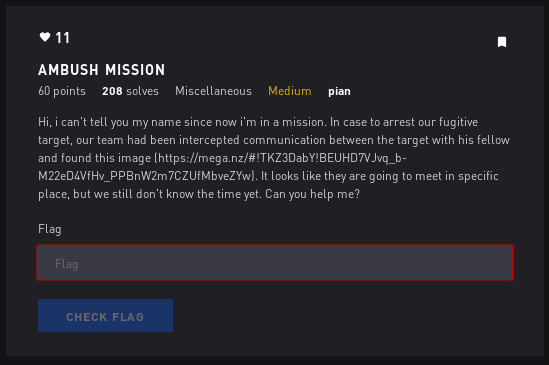

# Ambush Mission - Misc



## Initial Thoughts

* possible stego

# Walkthrough

Stegsolve.jar the image roll through the planes and we see

```
==QTh91Mx8Fd08VZt9FdFNTb
```

Reverse and decode

```python
a = "==QTh91Mx8Fd08VZt9FdFNTb"
print a[::-1].decode('base64')
```
Output:

<details>
	<summary>Flag</summary>

```
m3Et_me_4t_12_aM
```	
</details>


