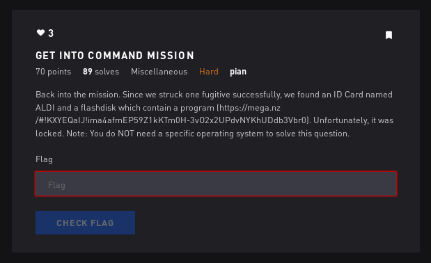

# Get Into Command Mission - Misc



## Initial Thoughts

* strings the .exe
* looks like a png
* write a script to change from base64

# Walkthrough

Open with bless
Search for "AL"
copy the base64 data

Script:

```python
#!/usr/bin/env python

f = open('./data', 'r').read()
open('./flag.png', 'w').write(f.decode('base64'))
```

<details>
	<summary>Flag</summary>


</details>
