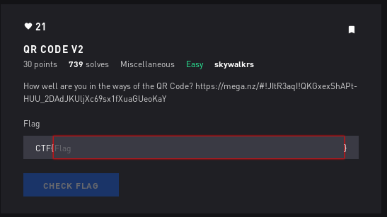

# QR2 - Misc



## Initial Thoughts

* use qr tool

# Walkthrough

```bash
zbarimg qr_code.jpg 
```
Output:
```
QR-Code:https://mega.nz/#!9NFhUbwQ!vtrLVum8z-ZXzur33RrGJ4uivMJhA9_5TW2ulHucXoU
scanned 1 barcode symbols from 1 images in 0.04 seconds
```
Link leads to flag.txt

```bash
cat flag.txt
```
<details>
	<summary>Flag</summary>

CTF{2_QR_4_U}
</details>