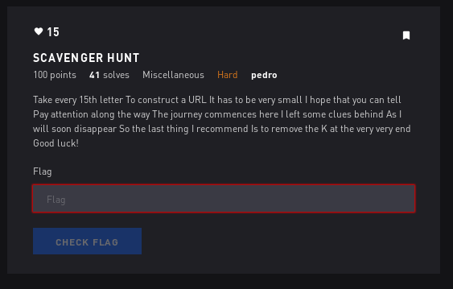

# Scavenger Hunt 1 - Misc



## Initial Thoughts

* looks like a pain in the ass

# Walkthrough

```
Take every 15th letter To construct a URL It has to be very small I hope that you can tell Pay attention along the way The journey commences here I left some clues behind As I will soon disappear So the last thing I recommend Is to remove the K at the very very end Good luck!
```
```python
a = "Take every 15th letter To construct a URL It has to be very small I hope that you can tell Pay attention along the way The journey commences here I left some clues behind As I will soon disappear So the last thing I recommend Is to remove the K at the very very end Good luck!"
a = a.replace("15", "")
a = a.replace("!", "")
a = a.replace(" ", "")
print a[14::15]
```
```output
tUyytwmtdatItG
```
Based on the problem text, I will assume it is a tinyurl

http://tinyurl.com/tUyytwmtdatItG

This leads us to a good drive

https://drive.google.com/drive/folders/0B1jsUOdZsv0hMXdHekh5UlN1c1U

Follow the folders down the rabit hole and we end up at a document full of O's

https://docs.google.com/document/d/1-j4Pz7NMj2R1zKMOS1am4CD2FnbZkdfDtExoRgR2tgo/edit

One "O" has a link

https://twitter.com/PC42661428/status/834934783796981761

bmr42iJAzsI

?v=

Spent hours on this trying to decipher, ended up just being a youtube link

https://youtu.be/bmr42iJAzsI?t=291

Santa Clause cash with a serial number 

<details>
	<summary>Flag</summary>

__F60202191K__
</details>

Lets try removing the K hinted at in the problem text. Thats our flag