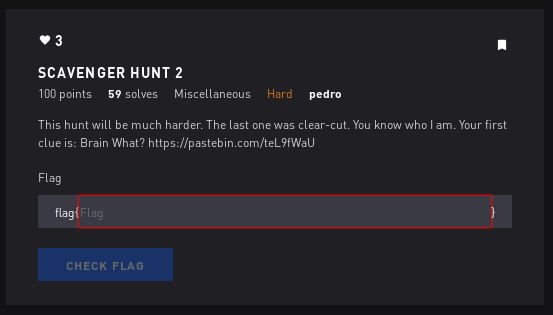
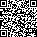

# Scavenger Hunt 2 - Misc



## Initial Thoughts

* go deeper

# Walkthrough

https://en.wikipedia.org/wiki/Esoteric_programming_language

Brainbash

use tio.run to interpret 3 times to spit out link below


https://drive.google.com/open?id=0B1jsUOdZsv0hbzNWSUxTVlF1ck0

Reorder the binary based on the numbers to the right of the column and we get this block

```
1111111001000001100111010100101111111
1000001011011000011000000111101000001
1011101001110010100001101011101011101
1011101011010000010000101110001011101
1011101000101111000101010010101011101
1000001010100111100001101101101000001
1111111010101010101010101010101111111
0000000000001101001001111001000000000
1111101111101011010100000110110101010
0001100101000000011111010000100001000
0001111110011001110001000011001101001
1110110111110011100011010010101100001
1100101000010001010011111100011011010
1100000010001110111111110100110101100
1111111101100111100000001111111010001
1110010011101101101101101001001101010
0101001000001010010010111101011111100
0000100010000000101110000000100101000
1110111011011001000011001001000101011
0001010011010011000111011001001000010
1111001010010001011100111011011011110
1110000111101110001110001100000100000
1101111100000111101011001001111001011
1100110000101101101111110010111010010
1100101010001010010010111101001011110
1111000101100000111110011000100100100
1001111100011001101011101001101000111
1000100011010010100101111001001000001
1011011110110000010010100111111111110
0000000010101110100110010011100010101
1111111011100111000011100100101011111
1000001000101100001111101010100011011
1011101011001011111000101111111111111
1011101011000000101110010011011010011
1011101011011001001001000110100000111
1000001010010010101111100011111000001
1111111011010001010100101110000100111
```
https://www.dcode.fr/binary-image

Put that in the above website to spit out a QR code.



Upload to this site to scan the QR https://zxing.org/w/decode
```
Decode Succeeded
Raw text	

Look, I don't have the flag anymore. I swear.
Horace Shimmingsworth stole it from me!

Raw bytes	

45 54 c6 f6 f6 b2 c2 04 92 06 46 f6 e2 77 42 06
86 17 66 52 07 46 86 52 06 66 c6 16 72 06 16 e7
96 d6 f7 26 52 e2 04 92 07 37 76 56 17 22 e0 a4
86 f7 26 16 36 52 05 36 86 96 d6 d6 96 e6 77 37
76 f7 27 46 82 07 37 46 f6 c6 52 06 97 42 06 67
26 f6 d2 06 d6 52 10 ec 11 ec 11 ec 11 ec 11 ec
11 ec 11 ec 11 ec 11 ec 11 ec 11 ec 

Barcode format	QR_CODE
Parsed Result Type	TEXT
Parsed Result	

Look, I don't have the flag anymore. I swear.
Horace Shimmingsworth stole it from me!
```
