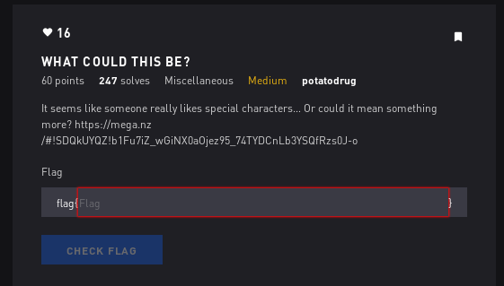

# What Could This Be - Misc



## Initial Thoughts 

* brainfuck
* other esoteric programming language

# Walkthrough

Poked around on esoteric programming wiki and saw one named jsfuck which looked to use the same symbols. I guess its valid javascript code so i threw it in tio.run (try it online) and it spit out the flag

<details>
	<summary>Flag</summary>

```java
undefined:3: ReferenceError: alert is not defined
alert("flag{5uch_j4v4_5crip7_much_w0w}")
^
ReferenceError: alert is not defined
    at eval (eval at <anonymous> (.code.tio:1:828), <anonymous>:3:1)
    at .code.tio:1:50263
```
</details>