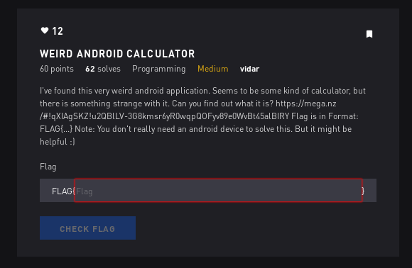

# Weird Android Calculator - Programming



## Initial Thoughts

* Find something to display the apk
* Kali comes with apktool

# Walkthrough

http://www.javadecompilers.com/apk

Went to this site and uploaded the apk to decompile into java and started exploring

found this little section that seemed interesting

```java
if (v > 100.0d) {
                for (int i : new int[]{1407, 1397, 1400, 1406, 1346, 1400, 1385, 1394, 1382, 1293, 1367, 1368, 1365, 1344, 1354, 1288, 1354, 1382, 1288, 1354, 1382, 1355, 1293, 1357, 1361, 1290, 1355, 1382, 1290, 1368, 1354, 1344, 1382, 1288, 1354, 1367, 1357, 1382, 1288, 1357, 1348}) {
                    Log.d("OUTPUT", Integer.toString(i ^ 1337));
                }
            }
            return v;
```

I decided to convert this to python to make it easier to read and print out (hopefully) the flag

```python
#!/usr/bin/env python

flag = ""
numbers = [1407, 1397, 1400, 1406, 1346, 1400, 1385, 1394, 1382, 1293, 1367, 1368, 1365, 1344, 1354, 1288, 1354, 1382, 1288, 1354, 1382, 1355, 1293, 1357, 1361, 1290, 1355, 1382, 1290, 1368, 1354, 1344, 1382, 1288, 1354, 1367, 1357, 1382, 1288, 1357, 1348]
for num in numbers:
	flag+= chr(num^1337)
print flag
```

<details>
	<summary>Flag</summary>

FLAG{APK_4nalys1s_1s_r4th3r_3asy_1snt_1t}
</details>