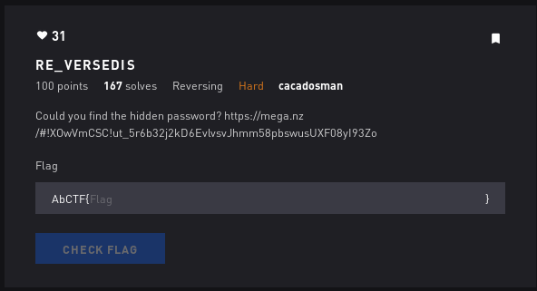

# Reverse Dis - Reversing



## Initial Thoughts

* Use ghidra to explore binary

# Walkthrough

strace and ltrace dont give much so I opened the binary in ghidra to have a look. Some interesting things of note is the variable "str" which holds a value of "IdontKnowWhatsGoingOn" and key which has a bunch of hex. On closer inspection of the code decompiled we see that str and key2 are xor'd together.

```bash
undefined8 main(void)

{
  int local_10;
  int local_c;
  
  printf("Input password: ");
  __isoc99_scanf(&DAT_001008f5,input);
  local_10 = 0;
  while (local_10 < 0x16) {
    *(int *)(key2 + (long)local_10 * 4) = (int)key[(long)local_10];
    msg[(long)local_10] =
         (byte)*(undefined4 *)(key2 + (long)local_10 * 4) ^
         (byte)*(undefined4 *)(str + (long)local_10 * 4);
    local_10 = local_10 + 1;
  }
  local_c = 0;
  while (local_c < 0x16) {
    if (input[(long)local_c] != msg[(long)local_c]) {
      stat = 0;
    }
    local_c = local_c + 1;
  }
  if (stat == 0) {
    puts("Wrong password");
  }
  else {
    puts("Good job dude !!!");
  }
  return 0;
}
```

So a new value, key2, takes every 4 hex character from key. Then key2 and str are xor'd together. We can extract the hex data from key and put it in sublimetext which will let us carve our only the hex we want to use. Then we can simulate the xor'ing of key2 and str in cyberchef and out pops the flag

<details>
	<summary>Flag</summary>


</details>