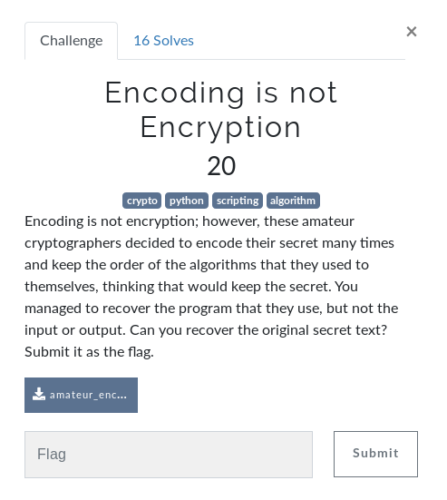

# Encoding is Not Encryption - Crypto

## Initial Thoughts

* base64, hex, base32 etc

# Walkthrough

Throw it in cyber chef and mix match hex/base32/base64 until you pop the phrase which is the flag

	
Flag

Let us encode just one more time, and then we will stop.

