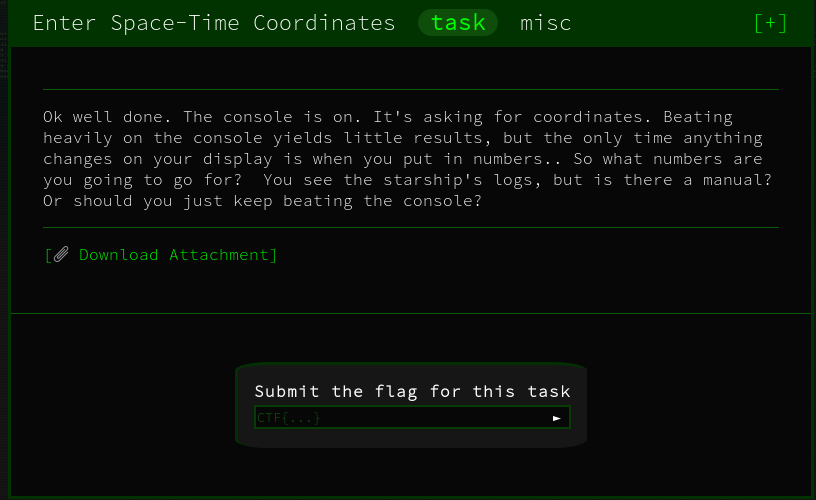

# Enter Space-Time Coordinates - Misc



## Initial Thoughts

* base64

# Walkthrough

We are given a list of coordinates in a text file and a program that prompts for the coordinates. Lets explore

After playing around with the program I tried a simple low hanging fruit technique and got the flag

```bash
strings rand2 | less
```

<details>
	<summary>Flag</summary>

CTF{welcome_to_googlectf}
</details>