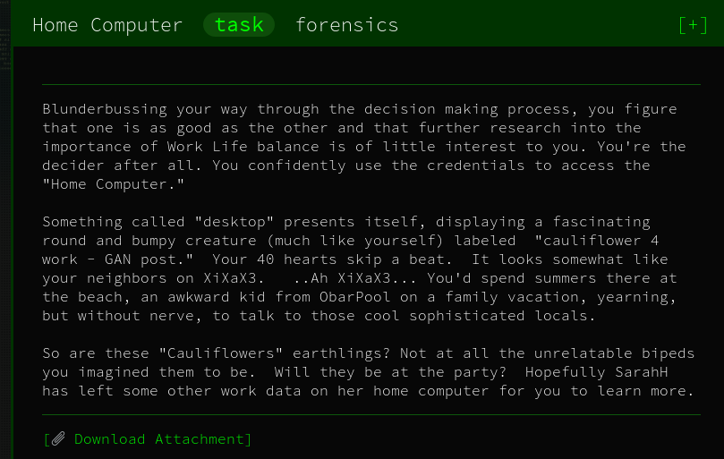

# Home Computer - Forensics



## Inital Thoughts

* load boot sector with testdisk

# Walkthrough

Loaded boot sector with tesk disk and copied several files over from the user "family"

Most files in the user directory were empty except for "credentials"

```bash
file *
```

```
credentials.txt:       ASCII text
credentials.txt:FILE0: PNG image data, 1234 x 339, 8-bit/color RGB, non-interlaced
document.pdf:          empty
preview.pdf:           empty
```

Changed the name of the png to a .png file and opened with PNG and got the flag

<details>
	<summary>Flag</summary>


</details>