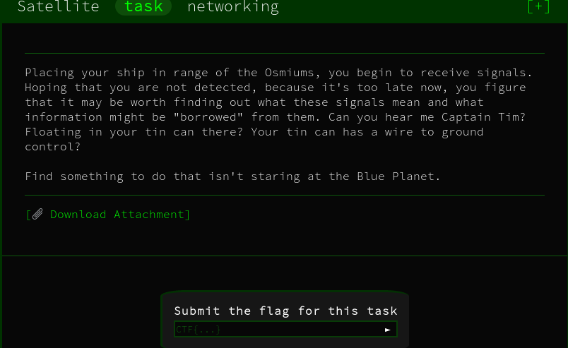

# Satellite 



## Initial Thoughts

* Red text on the sattellite, ?
* from the ad task CTF{9e796ca74932912c216a1cd00c25c84fae00e139}

# Walkthrough

Name is osmium, Logging in

https://docs.google.com/document/d/14eYPluD_pi3824GAFanS29tWdTcKxP_XUxx7e303-3E

Following the link takes us to some base64:

TG9naW5zIGZvciBob21lIGFuZCB3b3JrIGNvbXB1dGVyOgpVc2VybmFtZTogd2Vib3J0dG8KUGFzc3dvcmQ6IHRvdGFsbHktbm90LWEtZmxhZy1rZWVwLXNuaWZmaW5nCg==

Username: webortto
Password: totally-not-a-flag-keep-sniffing

Tried various things with no luck so I went back to the binary and opened with gdb.

Set a breakpoint and ran the program then executed the search 

```
search "CTF"
```

Got several results and one contained the flag


<details>
	<summary>Flag</summary>

CTF{4efcc72090af28fd33a2118985541f92e793477f}
</details>