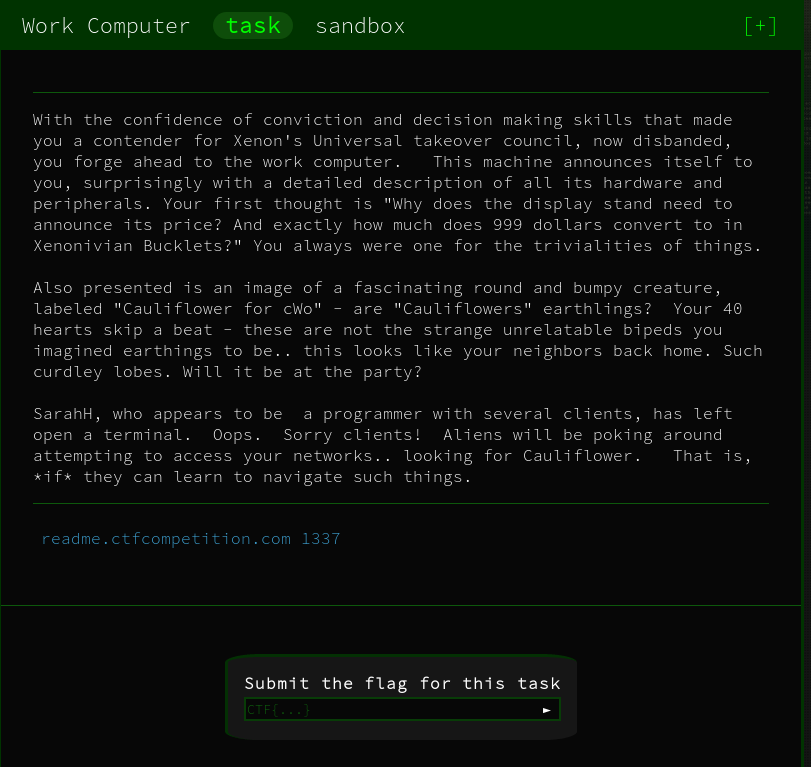

# Work Computer - Sandbox



## Initial Thoughts

* readme.ctfcompetition.com 1337
* no idea what sandbox means

# Walkthrough

```bash
ls -al
```
```
> ls -al
total 12
drwxrwxrwt    2 0        0               80 Jun 26 17:22 .
drwxr-xr-x   20 0        0             4096 Jun 13 14:28 ..
----------    1 1338     1338            33 Jun 26 17:22 ORME.flag
-r--------    1 1338     1338            28 Jun 26 17:22 README.flag
```


```bash
ls /usr/bin
```

```
> ls /usr/bin
[
[[
basename
beep
blkdiscard
c_rehash
cal
chvt
cksum
clear
cpio
crontab
cryptpw
dc
deallocvt
dirname
dos2unix
du
eject
env
expr
factor
fallocate
flock
fold
free
fuser
getconf
getent
groups
hostid
iconv
id
install
ipcrm
ipcs
killall
ldd
logger
lsof
lsusb
lzcat
lzma
lzopcat
md5sum
mesg
microcom
mkfifo
mkpasswd
nmeter
nohup
nproc
nsenter
nslookup
openvt
passwd
patch
pgrep
pkill
pmap
printf
pstree
pwdx
readlink
realpath
renice
reset
resize
scanelf
seq
setkeycodes
setsid
sha1sum
sha256sum
sha3sum
sha512sum
showkey
shred
shuf
smemcap
split
sum
test
time
timeout
top
truncate
tty
ttysize
udhcpc6
unix2dos
unlink
unlzma
unlzop
unshare
unxz
uptime
upx
vlock
volname
wc
which
whoami
yes
```

```bash
fold README.flag
```

<details>
	<summary>Flag</summary>

CTF{4ll_D474_5h4ll_B3_Fr33}
</details>

