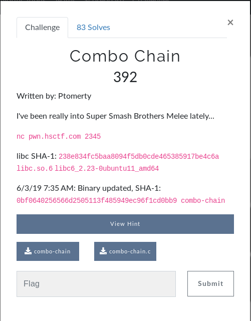

# Combo Chain (BINARY)



## Initial Thoughts

* ROP or ret2libc given the libc

# Walkthrough

## Find the padding if it exists

```bash
pwn cyclic 20 | ./combo-chain ; sudo dmesg | tail
```
	
```bash
pwn cyclic -l 0x0000000061616165
```

* The padding is 16.

We are not given a system address this time but we can ret2libc in order to pop adddress and system the /bin/sh

## Gather the libc addresses necessary

```python
system =
bash = 
