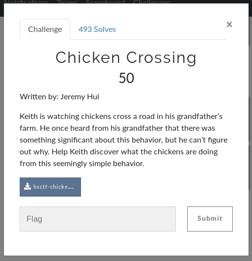
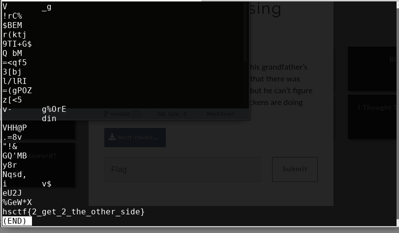

# Chicken Crossing (FORENSICS)

## Initial Thoughts

* __file__ command confirms jpeg
* strings ... never forget it

# Walkthrough

* initial low hanging fruit gives the flag through strings

	
Flag

