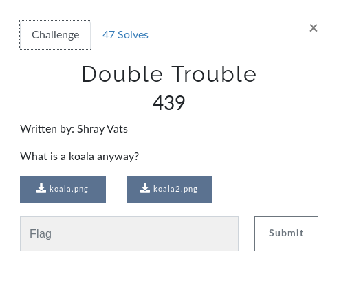
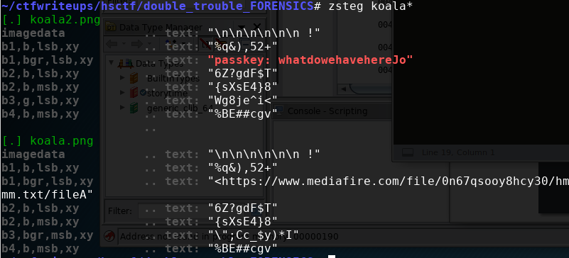

# Double Trouble (FORENSICS)



## Initial Thoughts

* hsctf{youthoughtboi} in strings, probably fake
* zsteg produces https://www.mediafire.com/file/0n67qsooy8hcy30/hmmm.txt/fileA in first image. download produces a txt file that appears to be GPG symmetrically encrypted data (AES cipher)
* zsteg koala2 puts out passkey: whatdowehavehereJo\

# Walkthrough

zsteg both pngs

```bash
zsteg koala*
```



We see a passkey and a download link. The download link produces a file named __hmmm.txt__ which files out to be aes gpg. Using the gpg tool and our password acquired from zsteg we can extract the flag

```bash
gpg --output flag.txt --decrypt hmmm.txt
```

<details>
	<summary>Flag</summary>

hsctf{koalasarethecutestaren'tthey?}
</details>