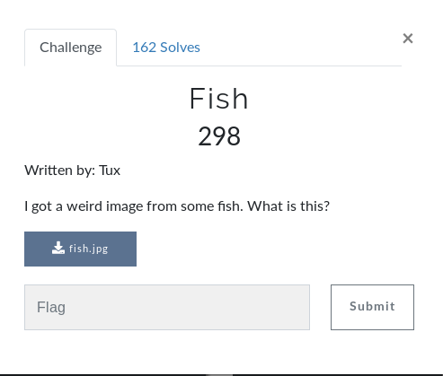
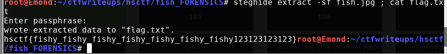

# Fish (FORENSICS)

## Intial Thoughts

* __file__ confirms jpeg
* strings ends with "bobross63"
* nothing in foremost/binwalk - diving into the hex
* stegoveritas doesnt show anything interesting at first glance
* stegsolve doesnt show anything interesting at first glance

# Walkthrough

Starting with the normal low hanging fruit procedures we find "bobross63" at the bottom of the file.

Run steghide with bobross63 as the password and we get a flag.txt to pop out!

	
Flag

