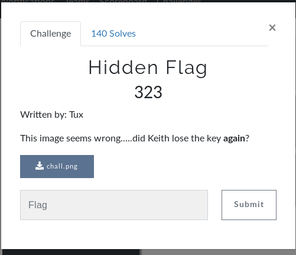

# Hidden Flag (MISC)



## Initial Thoughts

* Not actually a png
* strings shows "key is invisble"

# Walkthrough

Being that we are given "key is invisble" at the end of the file and the hint has the word __again__ in bold I will assume this is a xor problem. 

```python
import pwn
a = open('chall.png').read()
open('new.png', 'w').write(pwn.xor(a, 'invisble'))
```

Opening the newly created file results in the flag png below

<details>
	<summary>Flag</summary>


</details>