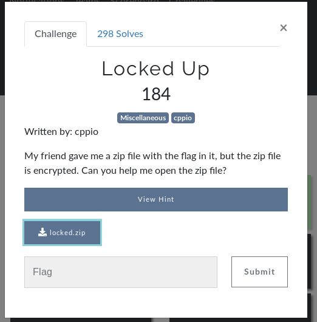

# Locked Up (MISC)



## Initial Thoughts

* zip must have a password that we need to locate
* attempting to open zip spits out a bunch of garbage

# Walkthrough

```bash
 strings locked.zip | grep hsctf
 ```

 <details>
 	<summary>Flag</summary>

 hsctf{w0w_z1ps_ar3nt_th@t_secUr3}
 </details>