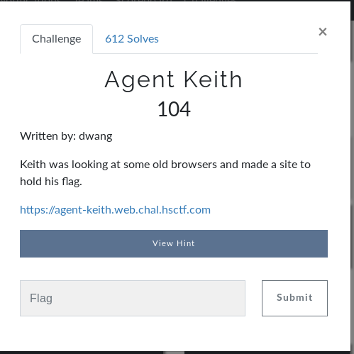
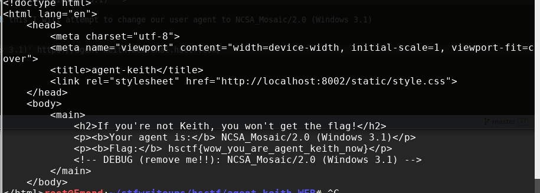

# Agent Keith (WEB)



## Initial Thoughts

* Something to do with user agent implied by the challenge title

# Walkthrough

Checking the source we find:

```html
<!-- DEBUG (remove me!!): NCSA_Mosaic/2.0 (Windows 3.1) -->
```
Combining the challenge hint with this I will attempt to change our user agent to NCSA_Mosaic/2.0 (Windows 3.1)

```bash
curl -A 'NCSA_Mosaic/2.0 (Windows 3.1)' https://agent-keith.web.chal.hsctf.com/
```

<details>
	<summary>Flag</summary>


</details>