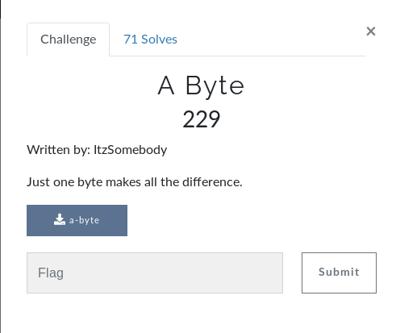
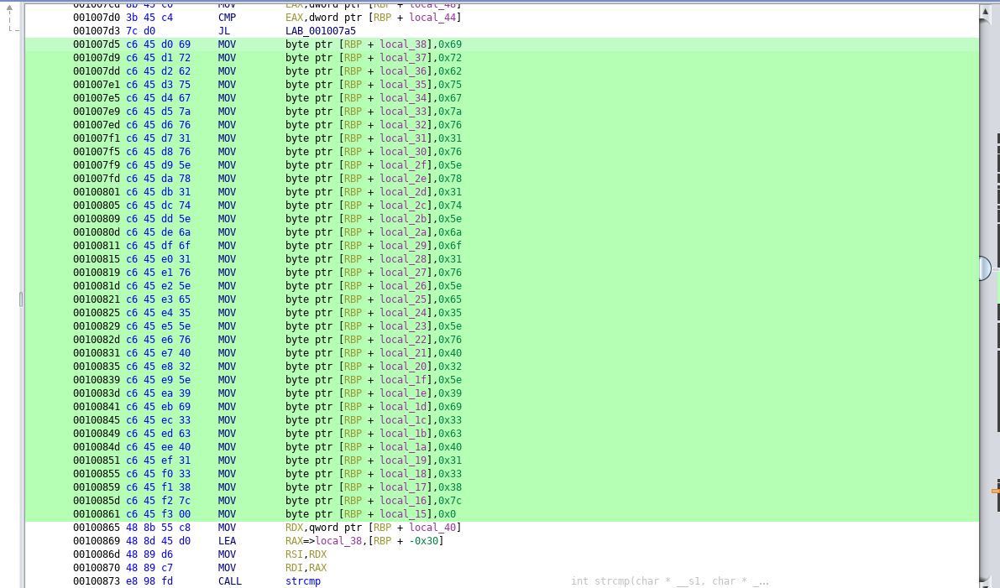
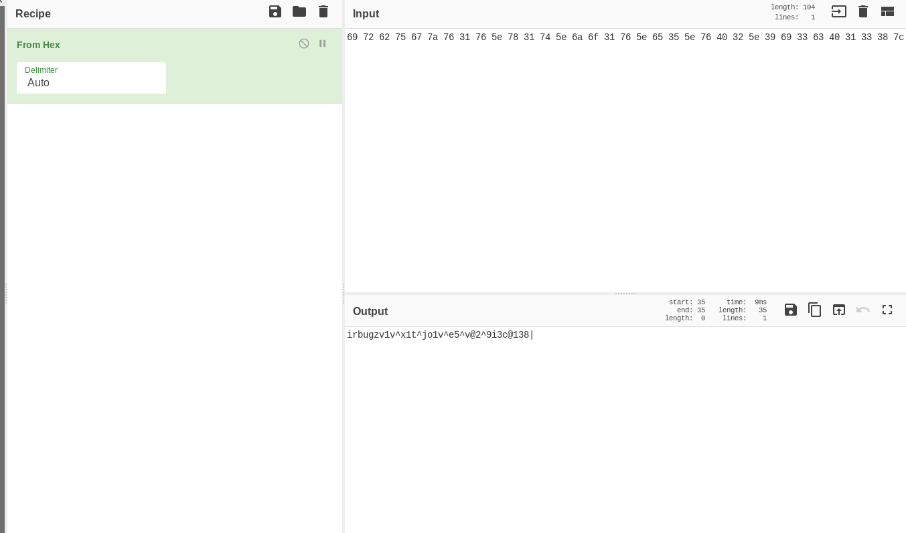
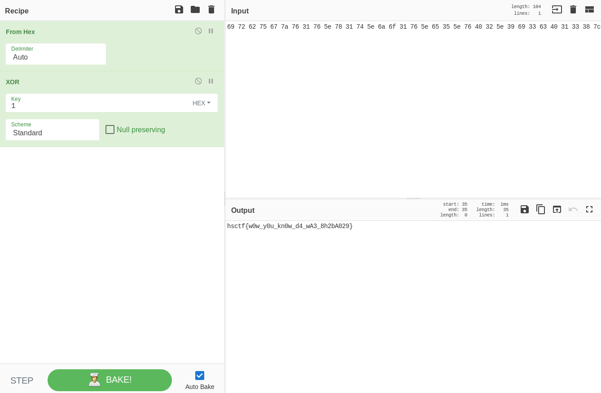

# A Byte

## Initial Thoughts

* ELF 64 bit executable
* strings doesnt give anything useful
* running strace/ltrace looks like the program just spits out a string
* diving into the binary with ghidra

# Walkthrough

* Open binary in ghidra or other disassembler
* Interesting section below

* Perform some sublime magic to separate the hex data from the stuff left of it
* Throw it in CyberChef to convert to ascii but it still results in garbage

* Go back to ghidra and notice the length is correct, but the input is xor'd with a key of 1
* Head back to CyberChef and add the xor recipe with key 1, flag acquired

	
Flag

