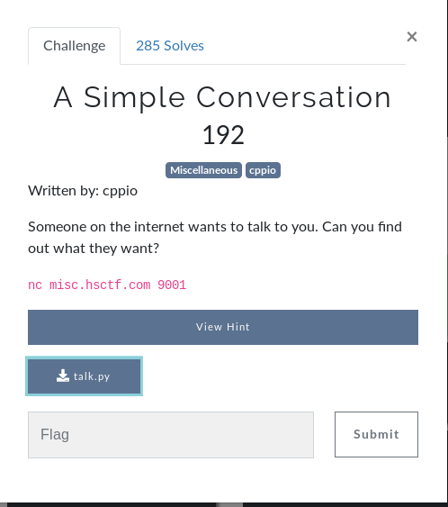

# A Simple Conversation (MISC)



## Initial Thoughts

* playing around with the given address it seems like a python script using input
* researching input shows a possible vulnerability if we can call something defined in the script
* luckily the source is given to us, diving in

# Walkthrough

Viewing the source below

<details>
	<summary>Source Code</summary>

```python
#!/usr/bin/env python3
from time import sleep

print("Hello!")

sleep(1)

print("Hey, can you help me out real quick.")

sleep(1)

print("I need to know your age.")

sleep(1)

print("What's your age?")

age = input("> ")

sleep(1)

print("Wow!")

sleep(1)

print("Sometimes I wish I was %s" % age)

sleep(1)

print("Well, it was nice meeting you, %s-year-old." % age)

sleep(1)

print("Goodbye!")
</details>
```
We can confirm the use of input but unfortunately it does not compare age to anything in order for us to take advantage of the easy exploit

After doing some research I found some code injection possibilities where we can use import sys in order to execute commands.  The final line that got the flag was **__import__("os").system("cat flag.txt")**

<details>
	<summary>Flag</summary>

hsctf{plz_u5e_pyth0n_3}	
</details>
