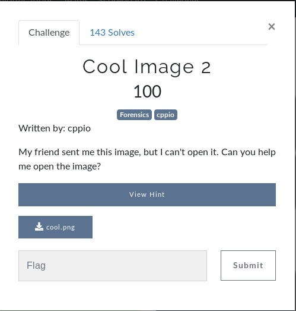
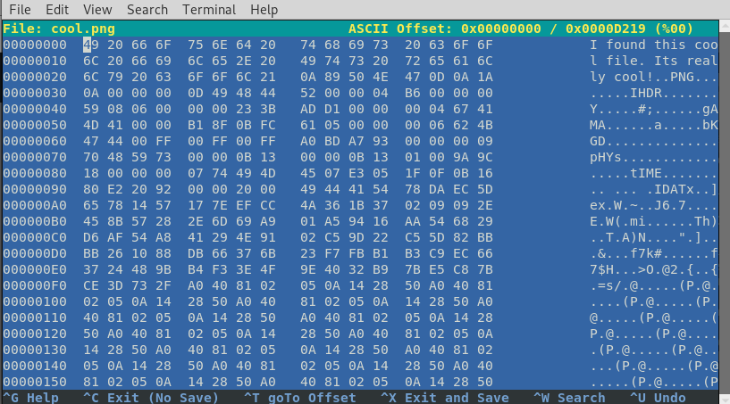

# Cool Image 2

## Initial Thoughts

* File results in just data (not a valid image)
* Verify integrity with hexeditor
* Run strings, binwalk, foremost

# Walkthrough

* Open file in hexeditor. String exists before png header

* Comparing a valid header with the file we can alter the hex using Bless and make it a valid PNG

* Saving the new PNG file and opening with EOG results in the flag

	
Flag

## Info Links

[PNG Header Info](https://digital-forensics.sans.org/media/hex_file_and_regex_cheat_sheet.pdf)