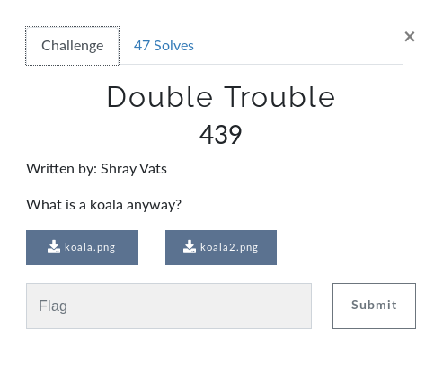

# Double Trouble (FORENSICS)

## Initial Thoughts

* hsctf{youthoughtboi} in strings, probably fake
* zsteg produces https://www.mediafire.com/file/0n67qsooy8hcy30/hmmm.txt/fileA in first image. download produces a txt file that appears to be GPG symmetrically encrypted data (AES cipher)
* zsteg koala2 puts out passkey: whatdowehavehereJo