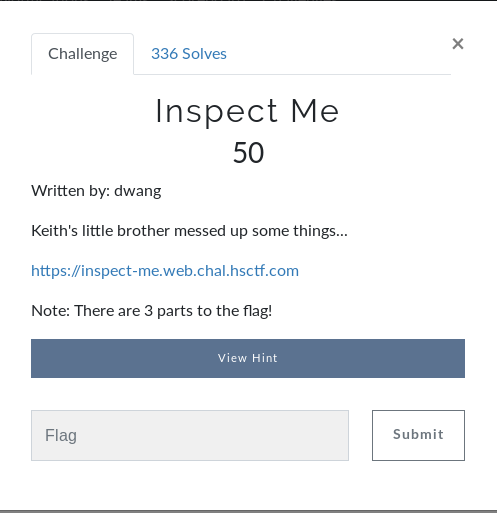
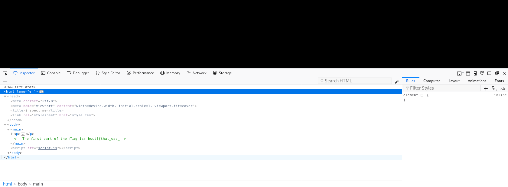
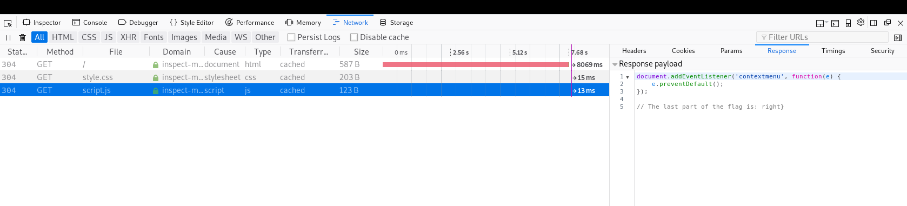

# Inspect Me (Web)

## Initial Thoughts

* Inspect me implies inspecting the source or elements of the web page

# Walkthrough

* Cant right click so i ctrl+shift+c to show the browser inspector, first part of the flag in the main

* Spent some time in the source poking around and found the 2nd part in the css file

* Last thing to check was the java script, sure enough the third part was there as well

	
Flag

hsctf{that_was_pretty_easy_right}

