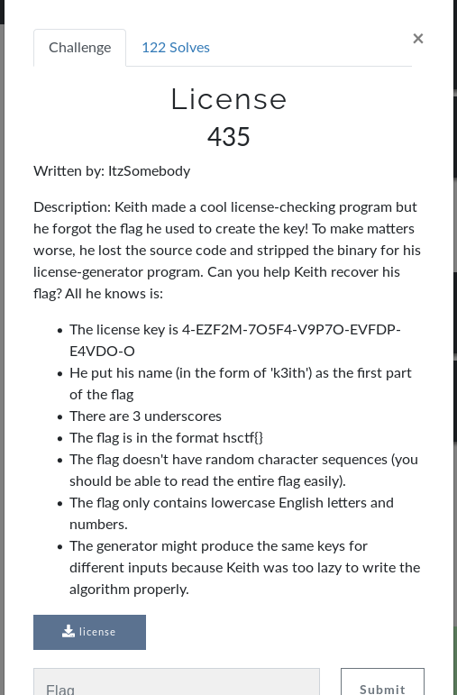

# License (RE)



## Initial Thoughts

* strace/ltrace doesnt give much
* given the clues the flag starts hsctf{k3ith.........}

# Walkthrough

I decided to borrow a script a wrote for an earlier challenge (Super Secure System) in order to brute force the license. I just had to modify the script to what the hint gave us: alphanumeric and only } and _ symbols. Code snippet below

<details>
	<summary>Brute License</summary>

```python
#!/usr/bin/env python
from pwn import *
from brute import brute
import sys

context.log_level = 'error'

def solve(license, flag, i):
	if "}" in flag:
		print "Flag: "+flag.lower()
		sys.exit()
	else:
		for s in brute(length=1, letters=True, numbers=True, symbols=False):
			p = process('./license')
			p.sendline(flag+s)
			p.recvuntil("\n")
			encrypted = p.recv()[:-1]
			if encrypted in license:
				flag+=s
				i+=1
				p.close()
				solve(license, flag, i)
			p.close()
		for s in symbols:
			p = process('./license')
			p.sendline(flag+s)
			p.recvuntil("\n")
			encrypted = p.recv()[:-1]
			if encrypted in license:
				flag+=s
				i+=1
				p.close()
				solve(license, flag, i)
			p.close()

flag = "hsctf{k3ith"
license = "4-EZF2M-7O5F4-V9P7O-EVFDP-E4VDO-O"
symbols = "_}"
i = 12
solve(license, flag, i)
```
</details>

<details>
	<summary>Flag</summary>

hsctf{k3ith_m4k3s_tr4sh_r3}
</details>