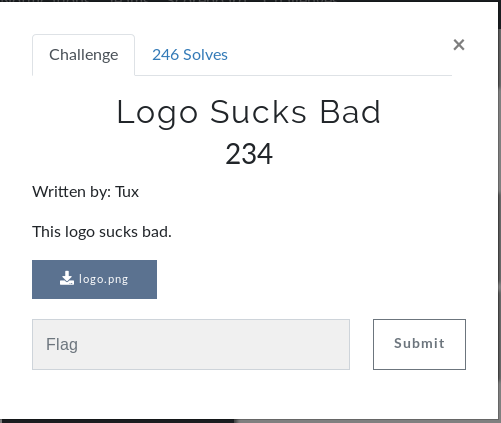
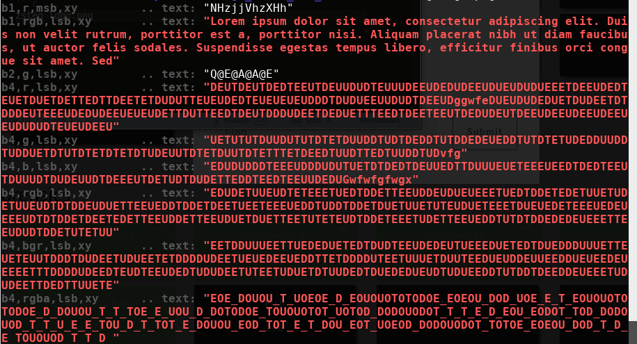
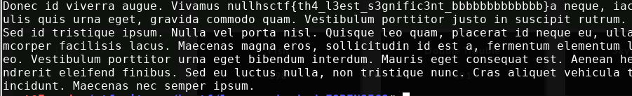

# Logo Sucks Bad (FORENSICS)



## Initial Thoughts

* nothing interesting with strings/exif/exiftool
* binwalk/foremost do not output anything
* nothing in hexeditor
* zteg shows a bunch of interesting text, extracting and inspecting

# Walkthrough

Run zsteg to check the png for data

```c
zsteg logo.png
```

<details>
	<summary>zsteg Output</summary>


</details>

Going through each section the one below seemed the most interesting

```c
zsteg -E b1,rgb,lsb,xy logo.png > output
```

```c
cat output | grep hsc
```

<details>
	<summary>Flag</summary>


</details>